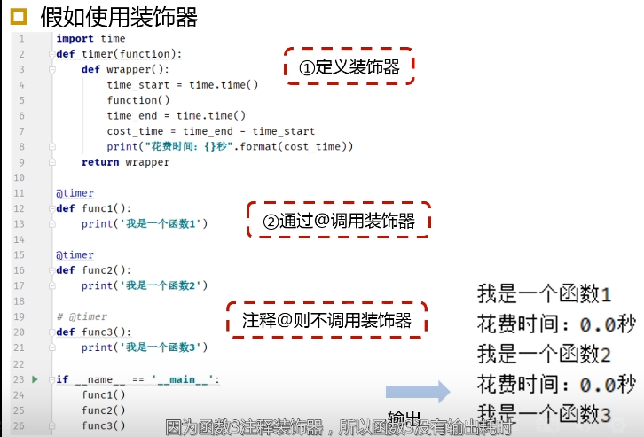

```python
# 创建 m x n
dp = [[0]*(n+1) for _ in range(m+1)]

# list - map
list(map(func,iter))

# loop enumerate
enumerate(sequence)
- (index, item)

for index, ele in enumerate(sequence):
	index , ele
 
# loop ziped list
 for xi, mi in zip(list1, list2):
 	xi, mi 

# loop dict
for k in dict 
for k,v in dict.items()

# sort dictionary 
[ (k,di[k])   for k in  sorted( di.keys() ) ]

# ASCII
0-9 A-Z a-z

# sort list 
list2.sort(key = list1.index)

# scientific 
format(1.2345,".2f") /  print(f"{a :.6f}")

# fill zero 
zfill vs rjust vs ljust

# 位运算
& and; | or; ^ xor; ~ not; <<; >>

# bytes - string
b'';  bytes.decode('utf-8'); str.encode('utf-8')

# deep copy list
import copy;  b = copy.deepcopy(a) 

# random 
random.random() -> [0,1)

# floor - ceil
math.floor(x); math.ceil(x)

# time 
import time; start = time.time()

# lambda
lambda x, y : x + y

                   
f
ff
f
                    
                    
100101011
011011111
and 
000001011
```

### int（）

```python
# int() -> 理解为只保留整数位
# 正数向下取整
int(1.5) = 1
int(2.5) = 2
# 负数时向上取整
int(-0.5) = 0
int(-1.5) = -1
int(-2.5) = -2

```


### heap

```python
import heapq

'''
创建堆 2种方法
- heappush one by one 
- heapify
'''
# 1
nums = [2, 3, 5, 1, 54, 23, 132]
heap = []
for num in nums:
    heapq.heappush(heap, num)
# 获取最小值不弹出
print(heap[0])

# 2
nums = [2, 3, 5, 1, 54, 23, 132]
heapq.heapify(nums)  # nums 改变

'''
heappop
'''
# 获取最小值,弹出
for i in range(len(nums)):
    print(heapq.heappop(nums))
print(nums)

'''
merge
'''
nums1 = [1,2,3,4,5]  # 必须排好序
nums2 = [3,4,5,6,7]  # 必须排好序
# 返回值的迭代器
nums = heapq.merge(nums1, nums2)
print(list(nums))

'''
replace
'''
nums = [2, 3, 5, 1, 54, 23, 132]
# 删除最小元素 并 加入一个元素
heapq.heapreplace(nums, 233)
print(nums)

'''
nlargest
nsmallest
'''
nums = [2, 3, 5, 1, 54, 23, 132]
# 最大/最小 得三个值
print(heapq.nlargest(3,nums))
print(heapq.nsmallest(3,nums))
```


## 装饰器

- **@**
- 不修改目标函数代码的前提下，为目标函数新增功能的函数
- or
- 不修改目标函数（或类）代码的前提下，为目标函数（或类）新增功能的函数（或类）




## 比较器

1. #### 自定义比较项

可以通过修改 `key=` 参数，使用 `lambda` 将输入的元素映射成一个值，这个值就代表了这个元素的大小。

- e.g. 
  - `key = lambda x, y : x + y`
  - `key = lambda t : 100*t.x. + t.y`


2. #### 自定义比较方法

可以通过修改 `key=` 参数，并借助内置的 `cmp_to_key` ，重写对两个元素的比较方法。

1. 自定义函数
2. 用lambda

```python
from functools import cmp_to_key

def cmp(t1, t2):
    """
    比较函数，需要满足：
    t1> t2  return  +
    t1< t2  return  -
    t1 = t2 return 0
    """
    if t1[0] == t2[0]:
        return t1[1] - t2[1]
	return t1[0] - t2[0]

l2 = sorted(l, key = cmp_to_key(cmp))

------------------------------------------
l2 = sorted(l, key=cmp_to_key( lambda a,b : a[0]-b[0] if a[0] != b[0] else a[y] - b[y]))

```


3. ### 自定义运算符

可以在类中重写比较函数，然后可以直接使用常规的比较运算符来判断两个对象（都属于这个类）的大小。

Python3中需要细分每一个比较运算符:

- ```python
  __lt__: <
  __gt__: >
  __ge__: >=
  __eq__: ==
  __le__: <=
  
  ```

- ```python
  class Pos:
      def __init__(self, x =0, y=0):
          self.x = x
          self.y = y
      
      def __lt__(self, other):
          return self.x < other.x if  self.x != other.x else self.y < other.y
      
      def __gt__(self, other):
          return self.x > other.x if  self.x != other.x else self.y > other.y
      
      def __ge__(self, other):
          return self.x >= other.x if  self.x != other.x else self.y >= other.y
      
      def __eq__(self, other):
          return self.x == other.x and self.y ==  other.y
      
      def __le__(self, other):
          return self.x <= other.x if  self.x != other.x else self.y <= other.y
  
  print(Pos(5,1) < Pos(5,2))  # return False
  print(Pos(5,1) < Pos(2,4))  # return True
  ```

- 注意！五个都必须重写了！


### 面试问题

- 生成器里面的sand得应用场景
  - 传数据给生成器函数。使用场景是造协程库。我永远也不会主动使用它
- 如何动态的创建一个类
  - type()。使用场景是造orm库。我用过但后来又发现不用也行。总的来说用不到。
- socket编程如何解决粘包
  - 是socket不是tcp对吧，那用udp就不粘了。
- socket断点续传如何解决
  - 用http的range头。
- 进程间通信有哪几种方式，那个最高效
  - 一次性执行的用命令行参数，作为服务执行的用socket。效率，反正不会是瓶颈，不做考虑。
- 如何排除数据库满得原因
  - ？
- 如何优化慢查询语句
  - ？
- ngnix为何单线程可数万并发？原理机制
  - epoll
- 前端jsonp跨域方案原理
  - ？
- python服务热更新方案
  - ？

我一般就问问**装饰器** 和 **元类**相关。和**代码设计**有关，高级用法，动态创建类，用到的时候查一下就可以了，知道有这么回事儿就行


