## 时间复杂度

- 常数时间操作：和样本量无关的操作
- eg：等差数列最高项为 n^2项， thus O（N^2）
- 哪个算法快？
  1. 对比big O：最差情况
  2. 一样就用样本去跑，用不同样本跑 （比常数项时间）

- big theta: 平均情况复杂度
  - 工程上喜欢用
- big omega: 最好情况复杂度


**优化的入手点**

1. input 数据的状况
2. output得 题目的标准


## 位运算

1. int 储存空间是**32 bits**

2. **除2的倍数**：

   - `a >> 1` means `a/2`

   - `a >> 2` means `a/4`

   ```
    位运算表示除以 2
   
       e.g.
       num = 22 = b"10110"
       num >> 1
           = b"1011" = 11
   
       num >> 1 -> 除以2
       num >> 2 -> 除以 (2x2)
   ```

3. **判断奇偶**：

   - 奇数 = `a & 1 == 1`

   - 偶数 = `a & 1 == 0`

   ```
   1. 位运算判断奇偶
       e.g.
       num = 22 = b"10110"
       num & 1
           = b"10110" and b"00001" = 00000
           确定最后一位是0还是1
           是1就=1
           是0就=0
   
       num & 1 == 1 -> 奇数
       num & 1 == 0 -> 偶数
   ```

   - 奇数：n % 2 == 1
   - 偶数：n % 2 == 0 


#### 找到int a 右位第一个0

- = a and (not a +1 )
- = **`a & (~a +1)`**

理由：

- int a = 108
- 假设 a = 01101100
- not a =  10010011
- +1 =      10010100
- and a =  00000100
- int result = 4


#### 找到L和R的中间值

```python
一般： mid = （R +L）//2
问题：R+L 太大的话容易溢出
(R + L - L + L) // 2 =(R-L)//2 +L = (R-L >> 1) +L
# - 比 >> 运算符优先
```


- 


### 运算符优先级

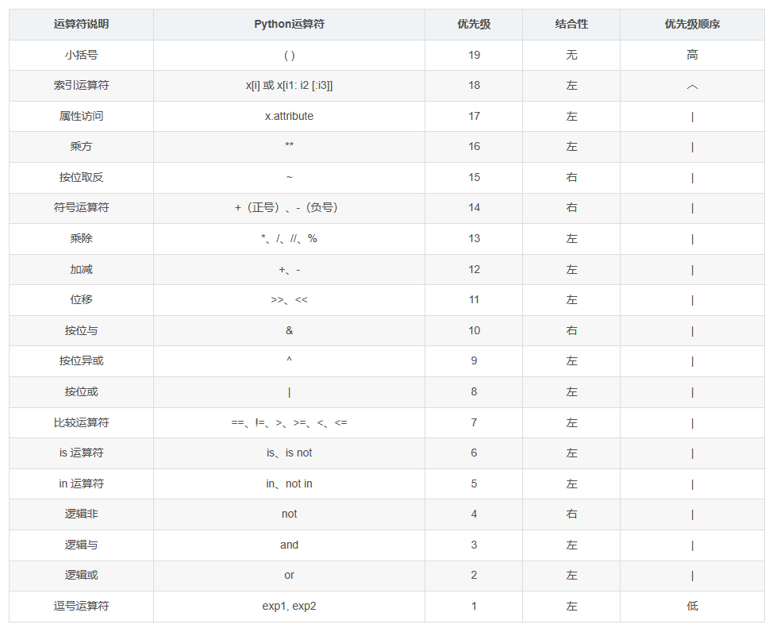

1. 小括号最优先

2. 位运算 
   - 比 比较运算符(== != >=) 优先；
   - 在 加减号(+ -) 之后

3.  特殊： `~` 按位取反
   - 比 正负号(+ -) 优先；
   - 在 乘方号( ** ) 之后
4. 位运算之间：
   - 优先 ⬇️
   - &  / and 
   - ^ / xor
   - | / or
   - 最后 ⬇️


### AND

- 于， &
- 理解：
  1. 11为1，其他为0

- 性质：
  1. `0 & N = 0`
  1. `1 & N = N`


### XOR

- 异或， `^`
- 理解：
  1. 相同为0，不同为1
  2. 位数相加不进位

- 性质：
  1. `0 ^ N = N`
     - 0 ^ 1 = 1
     - 0 ^ 0 = 0
  2.  `N ^ N = 0`
     - 0 ^ 0 = 0
     - 1 ^ 1 = 0
  3. 满足交换律和结合律（谁乘谁，怎么乘，结果都是一样的）
     - a ^ b = b ^ a
     - a ^ b ^ c =  a ^ (b ^ c )
     - 为什么？
       - 因为对于这32位数来说， 对于任何一位数字，都是n个1 和 m个0 异或在一起。 
       - 异或：位数相加不进位
       - n个1 和 m个0 异或 = 
         - 偶数个1 最终 = 0
         - 奇数个1 最终 = 1
       - 所以数字出现的顺序无关
     - 也就是说：顺序无关

- 应用（题）

  1. list of [int], 里面有正整数，所有数字都出现了偶数次，只有**一个数字a**出现了奇数次，请找到它：

     - 把所有的int都异或起来

     - 因为 N ^ N = 0, N ^ 0 = N

     - 最后只会剩下那个a

       ```python
       l = [a,a,a,g,g,l,l,l,l]
       a = 0
       for i in range(len(l)):
           a = a ^ l[i]
       return a
       ```

     - 复杂度：

       - 时间: O(n)
       - 空间: O(1)

  2. list of [int], 里面有正整数，所有数字都出现了偶数次，只有**两个数字a和b**分别出现了奇数次，请找到它：

     - 把所有的int都异或起来 = a ^ b = c

     - 需要找到 a or b 其中的一个

     - 因为 a != b, 所以 a^b != 0, 所以c其中一个位数（假设这个位数是32位中的第8位）一定是一个0一个是1

     - 所以我们可以把list中的所有数字分成2波

       - 一波A第8位是0， 一波B第8位是1

     - 把A里面的所有数都异或起来 = a或者b的值，say = b

     - c^b = a ^ b ^ b = a ^ 0 = a

     - ```python
       l = [a,a,a,g,g,l,l,l,l]
       
       # find a ^ b
       c = 0
       for i in range(len(l)):
           c = c ^ l[i]
       
       # find c 右数第几位是 1
       n = c & (~c+1)
       
       # find A and B
       A = []
       for i in range(len(l)):
           # 这里不可以 == 1， 应该是 == n, 那个位数为1
           if (n & l[i]) == 0:  # 那个位数是0
               A.append(l[i])
       
       # find a
       a = 0
       for i in range(len(A)):
           a = a^A[i]
       
       # find b 
       b = c ^ a
       
       return a, b
       ```

     - 复杂度：

       - 时间: O(n)
       - 空间: O(1)


## Sort


### Selection Sort

一轮一轮看，把最小的提到前面

- j = 0 -> n
- j = 1 -> n
- …
- j = n-1 -> n
- i 共= n-1次 

```python
l = [9,4,2,1,3,4,5]

for i in range(len(l)-1):  # 0 - n-2
    small = 99999999999
    index = -1
    for j in range(i, len(l)):  # i - n-1
        if l[j] < small:
            small = l[j]
            index = j
    # swap
    l[i], l[index] = l[index], l[i]

print(l)
```

复杂度：

- 时间: O(n^2)
- 空间: O(1)


### Bubble Sort

每两位都对比，每一轮最大的都会在最后一位

- 做n-1次
- 每一次都从0 - last
  - swap 如果左大于右边
- last = n - i

```python
def bubble_sort(l):
    l = [9, 4, 2, 1, 3, 4, 5]

    for i in range(len(l)):
        for j in range(len(l)-i-1):
            if l[j] > l[j+1]:
                # swap
                l[j], l[j+1] = l[j+1], l[j]
    return l
```

复杂度：

- 时间: O(n^2)
- 空间: O(1)

 

### Insertion Sort

- idea: 之跑一次，每往前走一次，让前0-0， 0-1， 0-3， … 0-n有序，怎么有序？从最前一位往前看，插入在应该的位置

- 插入？ 其实从后往前对比，一直swap回去

- ```python
  def insertion_sort(l):
  
      for i in range(len(l)):  # 0 - n
          # 前i位 ok
          # num = l[i]
          for j in reversed(range(i)): # i - 0
              if l[j] > l[j+1]:
                  # swap
                  l[j], l[j+1] = l[j+1], l[j]
              else:
                  break
      return l
  ```

复杂度：

- 数据状况不同，复杂度就不同：
  - [0,1,2,3] -> O(N)
  - [3,2,1,0] -> O(N^2)

- 时间: O(n^2)
- 空间: O(1)


### Merge Sort

请先观看[递归](#递归)部分

归并排序【实现】

- 两部分：
  - 一半一半 （二分法+递归）
  - merge left and right （双指针）

- idea：
  - 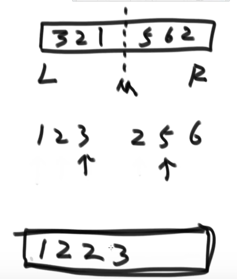

- ```python
  def merge_sort(l):
      left = 0
      right = len(l)
      if right == 1:
          return l
      mid = (right - left >> 1) + left
      list_l = merge_sort(l[:mid])
      list_r = merge_sort(l[mid:])
      return merge(list_l, list_r)
  
  
  def merge(ll, rr):
      p1 = 0
      p2 = 0
      length_l = len(ll)
      length_r = len(rr)
      final = []
      while True:
          if p1 > length_l - 1:
              final.extend(rr[p2:])
              break
          if p2 > length_r - 1:
              final.extend(ll[p1:])
              break
  
          if ll[p1] >= rr[p2]:
              final.append(rr[p2])
              p2 += 1
          else:
              final.append(ll[p1])
              p1 += 1
      return final
  ```

- 复杂度：
  - 应用Master Theorem：
    - 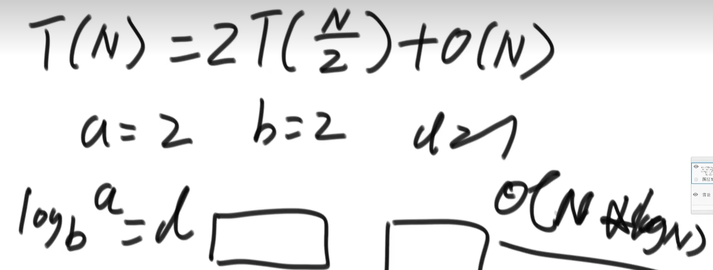
  - **时间：O(N log N)**
  - **空间：O(N)**
    - merge只申请一个最长为N的空间

- 为什么 merge sort 好？ -》 比较信息都留着
  - 为什么比 Selection，Bubble 和 Insertion 好？
  - O（N^2）的，第一轮都比较了N次，才知道一个数的位置； 第二轮都比较了N-1次，才知道第二个数的位置；… 每一轮都大量比较信息，但是只能搞定一个数
  - O(N log N)的，左侧有序，右侧有序，merge后生成一个大的有序的，这个大的又和别的大的merge生成一个更大的有序的… 每一轮得比较信息都留着，且向下传递成为一个整体有序得部分

- **外排序**：两个指针走，结果记录在外面的list里


### Quick Sort

请先观看[指针部分](#jump1)

#### 1.0

- （双指针）每次排一个，pivot( P )，确保P所在位置是正确的，二分，两边都递归
- 每次选择P得时候，我们都选数组最后一个数
- 最差情况：因为12345就是最差的，可以人为划分到最差的位置
  - 划分值很偏
  - **时间：O（N^2）**，等于冒泡一次排一个最差在后面
  - **空间：O（N）**，递归n层，每层记忆了一个数，（因为顶多记忆到最高层数，往上返回德时候记忆就释放了）

#### 2.0

- （三指针）每次排一个，pivot( P )，确保**P和所有和P相等的数**所在位置是正确的，二分，两边都递归
- 每次选择P得时候，我们都选数组最后一个数
- 最差情况：因为12345就是最差的，可以人为划分到最差的位置
  - 划分值很偏
  - 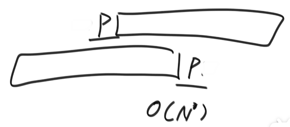
  - **时间：O（N^2）**，等于冒泡一次排一个最差在后面
  - **空间：O（N）**，递归n层，每层记忆了一个数，（因为顶多记忆到最高层数，往上返回德时候记忆就释放了）

#### 3.0

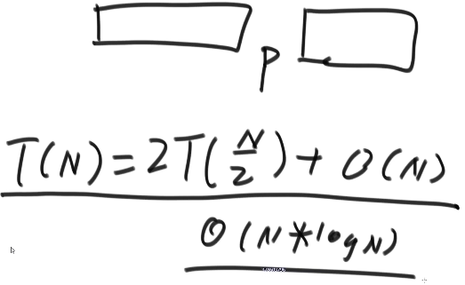

- （三指针）每次排一个，pivot( P )，确保P和所有和P相等的数量所在位置是正确的，二分，两边都递归
- 每次选择P得时候，我们都**随机选一个数**，放在最后面，他就是我的划分值
  - 概论实践
  - 所有可能性列出来：
    - 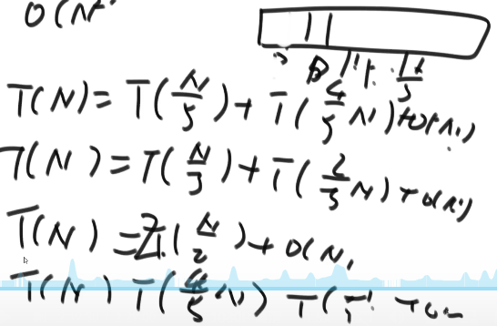
  - 每一种情况只占1/N得比例
  - 把所有可能性加权累加，再求数学期望
  - **时间：O(N log N)**
- **空间：O（log N）**
  - 递归log n层，因为每次p打在中点，就等于log n个p就达到最深处，二分法是log n嘛，每层记忆了一个数。
  - （因为顶多记忆到最高层数，往上返回德时候记忆就释放了）
  - 本质上也是好情况坏情况分类再概率累加的结果
- Note：我把递归改成迭代，这样不能省下空间吗？
  - 不能，递归我们左边传回来，打算往右边递归得时候，我们得记录从哪里开始算右边第一个得这个信息。这个信息必须压栈。所以即使改成迭代这个信息也必须得记录。

算法实践讲解：

- Quick Sort
  - 停止条件：传进来数组长度不够2
  - 随机pivot p
  - 3 pointers 把p放对位置
  - 两个递归call partition
  - 整理并 return 数组
- Partition：
  - 停止条件：传进来数组长度不够2
  - 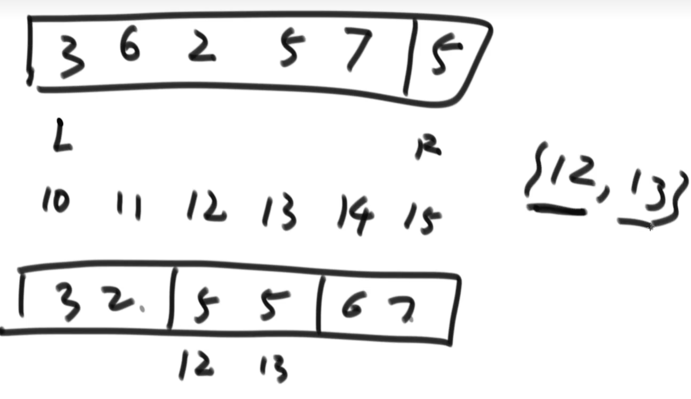

- 实现：

  - ```python
    def quick_sort(l):
        length = len(l)
        if length <= 1:
            return l
        # 随机出一个pivot
        p = int(random.random()*(length-1))
        # 3pointers 把p放对位置
        l, p1, p2 = partition(l, l[p])
        # recursion
        l_l = quick_sort(l[:p1])
        l_r = quick_sort(l[p2+1:])
        # get the l
        l[:p1] = l_l
        l[p2+1:] = l_r
        return l
    
    def partition(l, target):
        # modified triple_pointers
        if len(l) <= 1:
            return l, 0, 0
        p1 = p2 = 0
        p3 = len(l) - 1
        while p2 <= p3:
            if l[p2] < target:
                l[p1], l[p2] = l[p2], l[p1]
                p1 += 1
                p2 += 1
            elif l[p2] == target:
                p2 += 1
            else:  # if l[p2]> target
                l[p3], l[p2] = l[p2], l[p3]
                p3 -= 1
        # return p1 p3
        return l, p1, p3
    ```


### Heap Sort

请先观看[堆部分](#堆)

#### 1.0

- idea：
  - 利用heap insert 和 heapify

- 步骤
  1. 数组整体变成大根堆 = 用户一个一个给数组怎么调整 = heap insert 数组 长度次
  2. 【循环】把最后一个值和root值做交换，heap_size - - (老root值 在正确的位置上了) 
     - do heapify

- 代码：

  - ```python
    def heap_sort(l):
        # add one by one
        for i in range(len(l)):
            l = heap_insert(l, i)
    
        # take away one by one
        for i in reversed(range(len(l))):
            # for each run, the l[i] is in correct place
            l[0], l[i] = l[i], l[0]
            l = heapify(l, 0, i-1)
    
        return l
    
    def heap_insert(l, index):
        '''
        l = 数组/heap
        index = 这个insert得数字所在的位置
        *放在最后，往上看爹
        '''
        father_index = int((index - 1) / 2)
        while l[index] > l[father_index]:
            l[index], l[father_index] = l[father_index], l[index]
            index = father_index
            father_index = int((index - 1) / 2)
        return l
    
    def heapify(l, index, heap_size):
        '''
        l = 数组/heap
        index = 这个新换来的得数字所在的位置
        heap_size = len(l)-1
        *放在最上，往下看孩子
        return： l
        '''
        left_child = 2 * index + 1
    
        while left_child <= heap_size-1:
    
            # 1. find biggest among left/ right
            left = l[left_child]
            right_child = 2 * index + 2
            if right_child <= heap_size-1:
                # right child exist
                if left > l[right_child]:
                    largest = left_child
                else:
                    largest = right_child
            else:
                # right child NOT exist
                largest = left_child
    
            # 2. find biggest among left/ right / father
            father = l[index]
            if father >= l[largest]:
                largest = index
    
            # 3. 最大的不是父亲就得swap
            if largest != index:
                l[index], l[largest] = l[largest], l[index]
                index = largest
                left_child = 2 * index + 1
            else:
                # 3. 最大的是父亲就得停
                break
        return l
    ```

- 时间复杂度：

  - **时间：O(N log N)**
  - **空间： O（1）** <– 这个算法最大的优点


#### 2.0

用heapify去替换heap insert

- 复杂度没有变但是第一步速度变快了一点
- 因为我们一开始就有一个list，而不是用户一个一个给。
  - [数组-变成->大根堆](#无序数组 转化成 大根堆)


时间复杂度：

- **时间：O(N log N)**
- **空间： O（1）**


代码：

```python
def heap_sort_2(l):  # O(N log N)
    # add the whole list
    for i in reversed(range(len(l))):
        l = heapify(l, i, len(l))

    # take away one by one
    for i in reversed(range(len(l))):  # O(N)
        # for each run, the l[i] is in correct place
        l[0], l[i] = l[i], l[0]
        l = heapify(l, 0, i-1) # O(log N)

    return l
```


## 对数器

- 有一个刚写的**方法a**，他应该很好但是我们不知道
- 有一个复杂，慢，但是容易实现的**方法 b**
- 做一个**随机样本生成器** -> 生成样本
- a和b都跑相同得样本， 不一样就打印返回
  - 然后人工调试 a or b
- 直到，e.g. 跑了50w对都对，那么a和b就都是对的

- 对比 bubble sort and selection sort:

  - ```python
    def random_list(max_len, max_num):
        # [0,1) -> [0,n) -> [0, n-1]
        length = int(random.random() * max_len)
        li = []
        for i in range(length):
            li.append(int(random.random() * max_num))
        return li
    
    
    def comparator(exp_num=5):
        max_len = 100
        max_num = 200
        correct = True
        for i in range(exp_num):
            li = random_list(max_len, max_num)
            l1 = selection_sort(li)
            l2 = bubble_sort(li)
            if l1 != l2:
                print(li)
                print(l1)
                print(l2)
                correct = False
                break
    
        if correct:
            print("win!")
        else:
            print("you fucked up.")
    
            
    comparator(100000)
    ```


## 二分法

复杂度：

- 时间: O(log n)
- 空间: O(1)


实现：

- 用左右两个pointer！


何时能使用：（有序无序无关）

1. 一个数 的左右两侧 和 题目要求的 有关
2. 确定可以左右扔掉一遍儿


### Q1 找存在

问题1：在一个有序数组中，找某个数是否存在

- 用 left 和 right 当 pointer
- 中间找到后直接返回

```python
l = [1, 2, 2, 2, 2, 2, 3, 3, 3, 3, 4, 4, 4, 4, 4, 5, 5, 5, 5, 5, 5, 5, 5]

def find_num(l, num):
    n = len(l)
    left = 0
    right = n - 1
    count = 0

    while left <= right:
        mid = (left + right) // 2  # = math.flor()
        count += 1
        print(mid)
        if num == l[mid]:
            return True, count
        elif num < l[mid]:
            right = mid-1
        else:
            left = mid+1
    return False, count

print(find_num(l, 6))
```


### Q2 >=某数 最左侧

问题2：在一个有序数组中，找 >=某个数 最左侧的位置

- 一定会跑到对和错只差1
- 程序一定会跑完

```python
def find_pos(l, num):
    n = len(l)
    left = 0
    right = n
    correct = n+1
    wrong = -1
    while correct-wrong != 1:
        mid = (left+right)//2
        if l[mid] >= num:
            correct = mid
            right = correct - 1
        else:
            wrong = mid
            left = wrong + 1

    return correct
```


### Q3 局部最小

问题3：在一个无序数组中，找1个局部最小值

- 此无序数组中：任意两个相邻元素不相等

- 局部最小定义：

  - l[0] < l[1] then l[0]
  - l[n-1] > l[n] then l[n]
  - l[a-1] > l[a] < l[a+1] then l[a]

- ```python
  def find_region_small(l):
      # check left
      if l[0] < l[1]:
          return l[0]
      left = 0
  
      # check right
      n = len(l)
      if l[n-2] > l[n-1]:
          return l[n-1]
      right = n-1
  
      # 开始
      while left <= right:
          mid = (right+left)//2
          ll = l[mid-1]
          mm = l[mid]
          rr = l[mid+1]
          if ll > mm and mm < rr:
              return mm
          elif ll < mm:
              right = mid-1
          else:
              left = mid+1
      return -1
  ```

  


## 递归

### 简单Recursion实例

- 求一个数组中的最大值：

- ```python
  def max_l(l, left, right):
      if left == right:
          return l[left]
      mid = (right - left >> 1) + left
      ll = max_l(l, left, mid)
      rr = max_l(l, mid + 1, right)
      return max(ll,rr)
  
  A = max_l([3,2,5,6,7,4,1], 0, 6)
  print(A)
  ```

树状图：

- 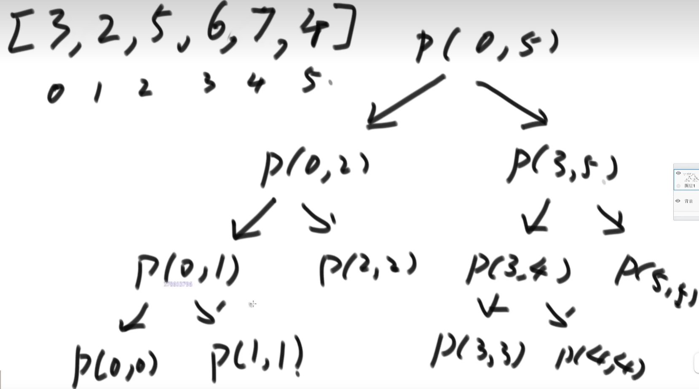

栈大小：

- 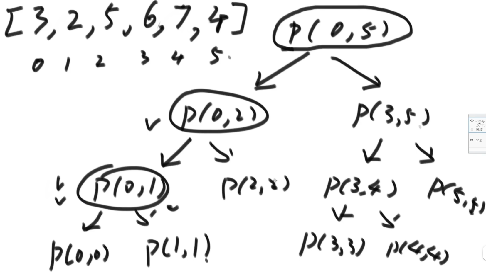

- 就是说，算 P（0,5）需要P（0，2）和P（3，5），算P（0，2）需要P（0，1）和P（2，2）…
  - 栈里会有：【P（0，5）， P（0，2），P（0，1），P（0，0）】
  - 这些个P正在**压栈**
  - **栈空间** = **树的高度**


### Master公式

- 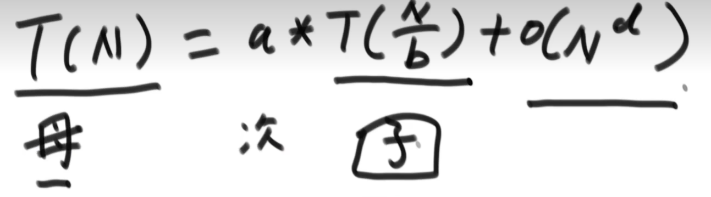
  - T(N): 母问题的数据量是N级别的 (个数据)
  - a: 子问题被调用了多少次
  - T(N/b): 子问题的数据量是N/b级别的
  - O(N^d): 除子问题之外，剩下得过程的时间复杂度

- **前提条件**：
  - **子问题规模必须一样**

- 例：应用在简单Recursion实例里：
  - 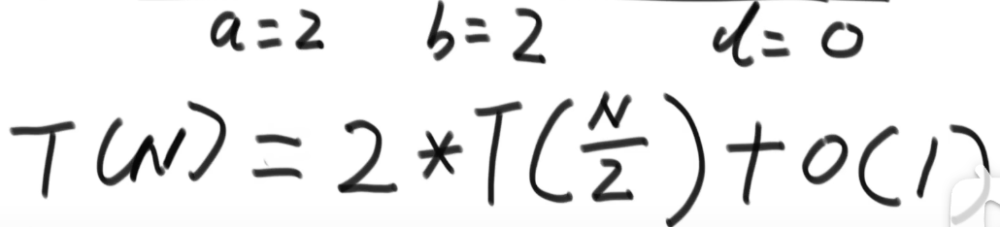
    - 母问题数据量：N
    - 子问题数据量：N/2
    - a = 2
    - O（1）

- **结果**：分三种情况，都可以直接求

  - 

  - 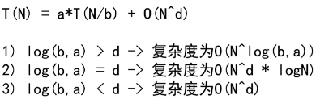


### 例1：小和问题

- 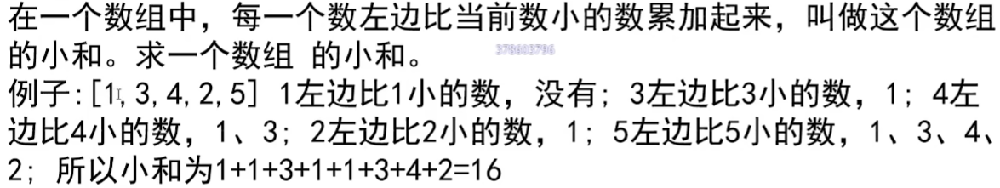
- 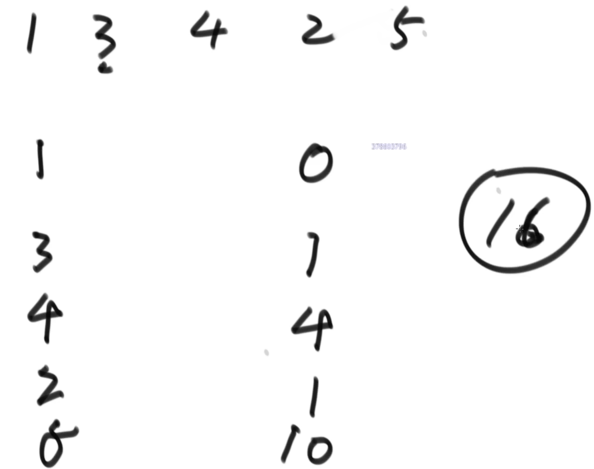

- 解：

  - 原问题：每一个数左边比他小的都加起来
  - 转化成等效问题：每一个数右边有几个比他大的就加几次
    - 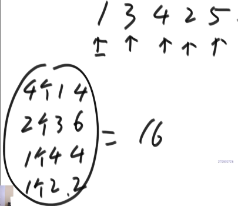

  - merge sort 变种：
    - 每一次merge的时候，当左边指针上得数小于右边的时候，accumulate += 右边所有的数得个数 * 左边指针上得数
    - 编程时Note：每一次merge的时候，当左右指针上的数一样的时候，必须先把右边的copy到下面，并且不计算accumulate
    - 理解时Note：必须排序，因为当左边指针上得数小于右边的时候，我们怎么得知有几个数比左边指针上得数小得呢？通过 len(right_list)-right_pointer. 所以右边必须是有序的
  - 理解：为什么是对的？
    - 一开始分成 1 3；4；2 5
      - 对于1来说，一开始分成 1 3；4；2 5 
      - 1对于3来说，算了1*1次
      - 1对于2 4 5 来说，算了 3*1次
      - 1一共算了4次，小和=4，没问题
    - 一开始分成 1 3；4；2 5 
      - 对于3来说，一开始分成 1 3；4；2 5
      - 3对于1来说，没算因为3在右边
      - 3对于2来说，没算因为3比2大
      - 3对于4 5 来说，算了 2*3次
      - 3一共算了2次，小和=6， 没问题
    - 以此类推，没有问题 
    - 假设这个数组是abcdefgh…
      - 那么这个c，
        - 只会和左边合并（不产生小和）
        - 和右边合并（会产生小和）
        - 可能会右合并很多次，每一次c会作为右边得一员和左边的全部字母计算小和（不漏不多）
      - 所有的字母都可以用这个c表示，证毕

- 应用：

  - ```python
    def merge_sort_mod(l):
        left = 0
        right = len(l)
        if right == 1:
            return l, 0
        mid = (right - left >> 1) + left
        list_l, sum_l = merge_sort_mod(l[:mid])
        list_r, sum_r = merge_sort_mod(l[mid:])
        temp_list, temp_num = merge_mod(list_l, list_r)
        # 这里，左半边得小和+右边得小和+merge得小和 = 整个的小和
        return temp_list, temp_num + sum_l + sum_r
    
    
    def merge_mod(ll, rr):
        p1 = 0
        p2 = 0
        length_l = len(ll)
        length_r = len(rr)
        final = []
        count = 0
        while True:
            if p1 > length_l - 1:
                final.extend(rr[p2:])
                break
            if p2 > length_r - 1:
                final.extend(ll[p1:])
                break
    
            if ll[p1] >= rr[p2]: # here must be >=,不可以，=，先后顺序matters
                final.append(rr[p2])
                p2 += 1
            else:
                final.append(ll[p1])
                # count
                # here comes the difference,不仅仅加index得差数，还必须乘左pointer
                count = count + (length_r - p2)*ll[p1]
                p1 += 1
        return final, count
    ```

    

### 例2：逆序对问题

- 问题：在一个数组中，左边的数如果比右边的数大（不需要左边右边连着），则这两个数构成一个逆序对，请返回所有逆序对。
  - 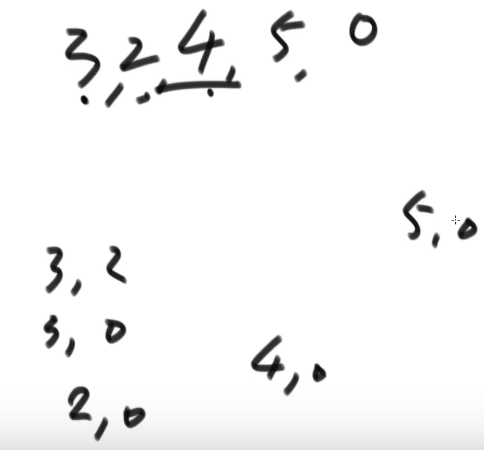
- 解析：和小和问题类似，小和是求右边几个数比他大，这个题在求说几个数比他小。

- ```python
  # 逆序对问题
  def merge_sort_mod_(l):
      left = 0
      right = len(l)
      if right == 1:
          return l, 0
      mid = (right - left >> 1) + left
      list_l, sum_l = merge_sort_mod_(l[:mid])
      list_r, sum_r = merge_sort_mod_(l[mid:])
      temp_list, temp_num = merge_mod_(list_l, list_r)
      # 这里，左半边得逆序对+右边得逆序对+merge得逆序对 = 整个的逆序对
      return temp_list, temp_num + sum_l + sum_r
  
  
  def merge_mod_(ll, rr):
      p1 = 0
      p2 = 0
      length_l = len(ll)
      length_r = len(rr)
      final = []
      count = 0
      while True:
          if p1 > length_l - 1:
              final.extend(rr[p2:])
              break
          if p2 > length_r - 1:
              final.extend(ll[p1:])
              break
  
          if ll[p1] <= rr[p2]:  # here must be <=,不可以，=，先后顺序matters
              final.append(ll[p1])
              p1 += 1
          else:
              final.append(rr[p2])
              # 问的是个数 = 1 * (左边index得差数)
              count = count + length_l - p1
              p2 += 1
      return final, count
  ```

  

总结

- merge sort变种 属于身在左，往右数。
  - 所有身在右，往左数得问题需要转化
- 右边几个数比他大，几个数比他小就在merge得时候数就行了
  - 注意等于得情况怎么处理  
  - 注意乘法计算


## <span id="jump1">指针</span> 

**快慢/双指针实质**：3块区域，两个条件

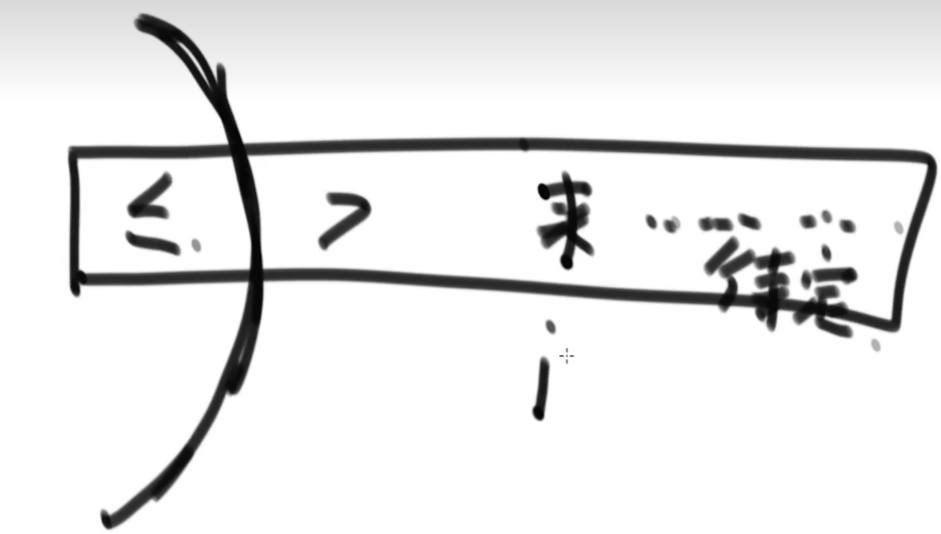

- 左指针左边：一个条件
- 左指针右边，右指针左边：一个条件
- 右指针右边：还没看，待定


**三指针实质**：4块区域，三个条件

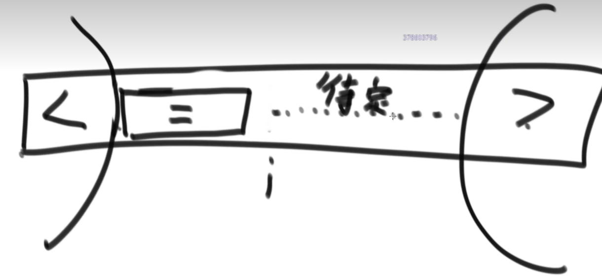

- 左指针左边：一个条件
- 左指针右边，右指针左边，中间指针左边：一个条件
- 左指针右边，右指针左边，中间指针右边边：还没看，待定
- 右指针右边：还没看，一个条件


### Q1 快慢指针

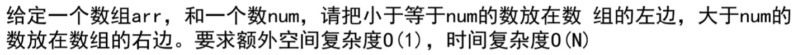

- 逻辑：指针p1, p2
  - while p2 < len(l)
    - if l[p2]<= target, swap l[p2] l[p1], p1++, p2++
    - if l[p2]> target, p2++


### Q2 荷兰国旗/三指针

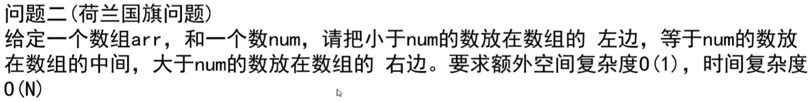

- 逻辑： 指针p1,p2,p3
  - while p2 <= p3:
    - if l[p2]< target, swap l[p2] l[p1], p1++, p2++
    - if l[p2]= target, p2++
    - if l[p2]> target, swap l[p2] l[p3], p3 - -, p2 **不变！**


## 堆 / 优先级队列

优先级队列（）结构，就是堆结构

- 堆顶，l[0], 就是优先级最大的

### 定义

- **堆结构**：完全二叉树结构

- **完全二叉树结构**：
  - **满二叉树**，或，从**左往右遍历遍出来得二叉树**

- **满二叉树**：
  - 每一层都是满的
  - 
  - 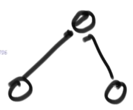

- **左往右遍历遍出来得二叉树**：
  - 每一层都是从左往右以此增加的不能跳着来
  - 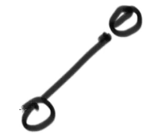
  - 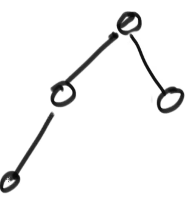
  - 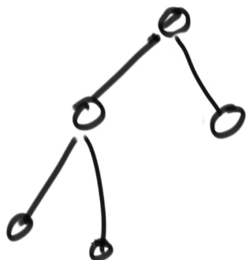

- **不是完全二叉树得反例**：
  - 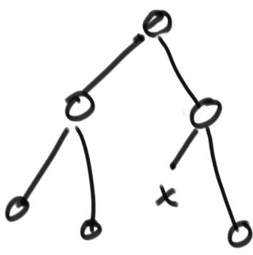


### 数组 转化成 二叉树

- 数组取一段：say，size = 5 和 7
- 那么对于数字有：
  - 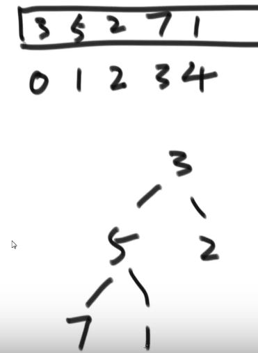

- 对于下标有：
  - 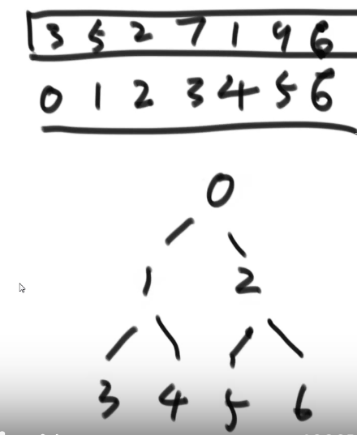

- 对于每一个下标 **i**，
  - 他的 左孩子 下标 = **2*i +1**
  - 他的 右孩子 下标 = **2*i +2**
  - 他的 父 下标 = **（ i-1 ）/2**  【向下取整 】


### 大根堆 

每一个子树得root/头节点，都是整个子树得最大值

e.g.

- 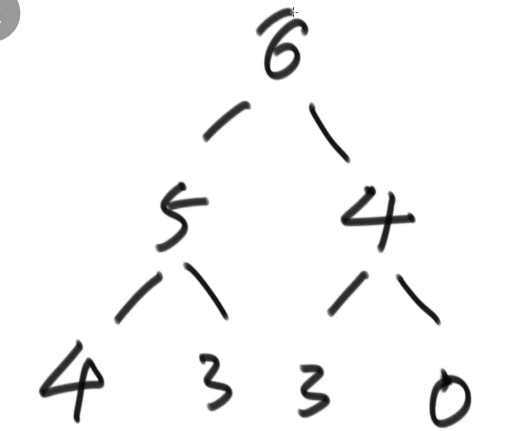
  - 以6为头，整棵树最大值是6
  - 以5为头，整棵树最大值是5
  - 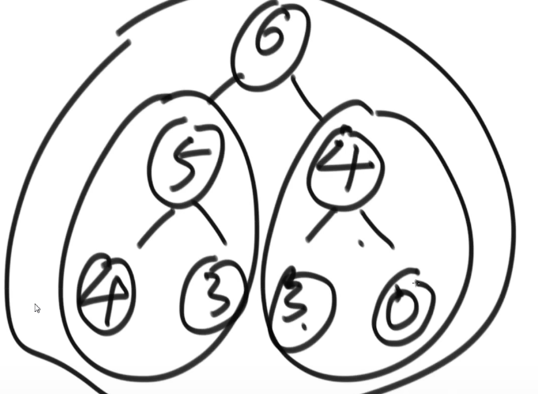


### 小根堆

每一个子树得root/头节点，都是整个子树得最**小**值


**heap size**

- 堆里面一共几个节点
- 数组里面从0出发的连续一共几个数


### heap Insert / +1

= 一个一个得无序数 转化成 大根堆

= 放在最下面，往上看爹

= 从下往上

算法：

- init：
  - heap_size = 0
  - 数组 = empty
  - 堆 = empty
- 用户每给一个数 a：
  - heap_size += 1
  - 数组 += a
  - 堆 += a
  - while a < 他的父：
    - （当a是root得时候，a=父=a。一个while语句包含了两种情况）
    - swap a 和 他的父 （数组和堆都这么做）

演示：

- 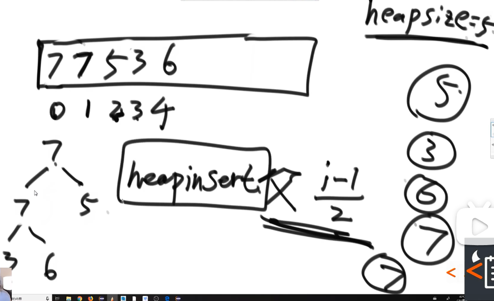


复杂度：

- 用户给我个数据插入得调整代价是？
- heap size = N， 那么heap高度是？log N 级别
  - heap size -> 高度
  - 1 -> 1
  - 2-3 -> 2
  - 4-7 -> 3
  - 8-15 -> 4
  - N -> 1+ floor [ log N ]

- 最大调整高度次
- 时间： **O（log N）**


代码：

```python
def heap_insert(l, index):
    '''
    l = 数组/heap
    index = 这个insert得数字所在的位置
    *放在最后，往上看爹
    '''
    father_index = int((index - 1) / 2)
    while l[index] > l[father_index]:
        l[index], l[father_index] = l[father_index], l[index]
        index = father_index
        father_index = int((index - 1) / 2)
    return l
```


### heapify / -1

= 用户要求返回大根堆中得最大值，返回后的堆得保证还是个大根堆

= 放在最上面，往下看孩子

= 从上往下

- 已知：
  - 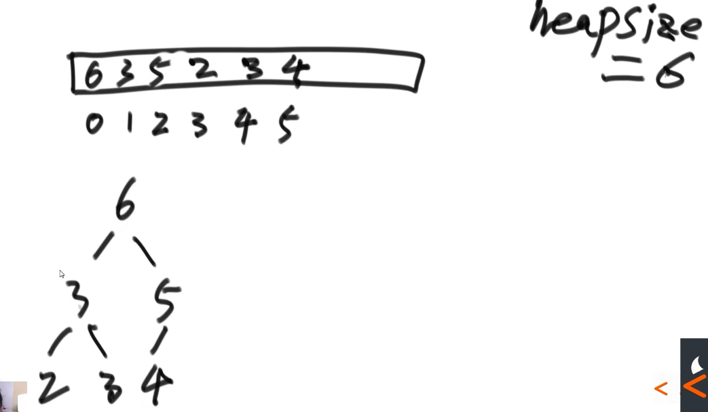

- 步骤：

  - init
    - 先用一个变量记住0位置上的数：say 6
    - 然后把最后一个数，say index = 5， value = 4，copy到0位置
    - heap size -= 1 （等于说 index 5 得那个4已经在无效区域里面， 这个4和堆没关系了）
    - 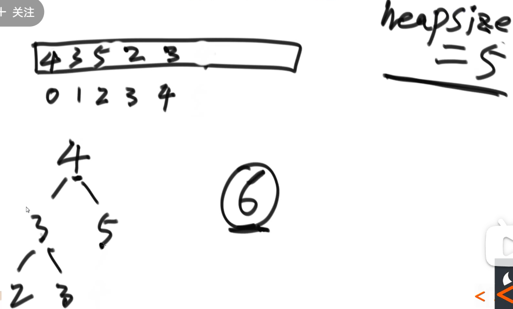

  - do heapify：
    - 头在左孩子右孩子中，选一个最大值，
    - 如果头小于最大值 swap 【循环】
    - 如果头不小于最大值 【停止】
    - 头没有孩子了 【停止】

- heapify算法框架：
  - 输入： list/数组，index/头得index，heap size
  - 过程：
    - 计算左孩子下标
    - while 左孩子小于heap size （还有孩子：
      - 对比左右，选一个最大的孩子
      - 对比头和大孩子，选一个最大的
      - 如果最大的是头： 头大：break
      - 如果最大的不是头：头小：
        - swap
        - 头index变成大孩子index
        - 左孩子下标更新
  - 输出：list（大根堆形势）

- 复杂度
  - 用户拿走一个数据得调整代价是？
  - 最多调整高度次
  - 高度是 log N 级别
  - 时间： **O（log N）**


代码

```python
def heapify(l, index, heap_size):
    '''
    l = 数组/heap
    index = 这个新换来的得数字所在的位置
    heap_size = len(l)
    *放在最上，往下看孩子
    return： l
    '''
    left_child = 2 * index + 1

    while left_child <= heap_size-1:

        # 1. find biggest among left/ right
        left = l[left_child]
        right_child = 2 * index + 2
        if right_child <= heap_size-1:
            # right child exist
            if left > l[right_child]:
                largest = left_child
            else:
                largest = right_child
        else:
            # right child NOT exist
            largest = left_child

        # 2. find biggest among left/ right / father
        father = l[index]
        if father >= l[largest]:
            largest = index

        # 3. 最大的不是父亲就得swap
        if largest != index:
            l[index], l[largest] = l[largest], l[index]
            index = largest
            left_child = 2 * index + 1
        else:
            # 3. 最大的是父亲就得停
            break
    return l

```


### 无序数组 转化成 大根堆

- idea：
  - 从后往前，每一个节点都当作头节点，heapify每一个头节点形成的子树
  - 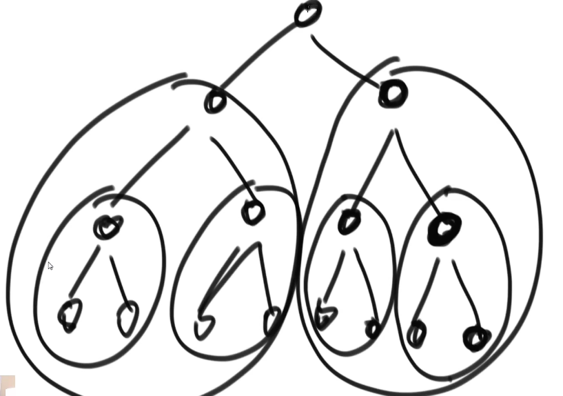

- 复杂度：
  - **时间：O(N)**
  - **空间: O（1）**

- 时间复杂度证明：
  - 数组中N个数，
    - 叶节点（倒数最后一层）有ceil（N/2）个
      - 这些只需要看一眼
      - 代价 = 1
    - 那么需要heapify一层得节点（倒数第二层）有floor（N/4）个
      - 这些需要 看一眼+heapify一步
      - 代价=2
    - 那么需要heapify一层得节点（倒数第三层）有floor（N/8）个
      - 这些需要 看一眼+heapify两步
      - 代价=3
  - 整体来看：
    - T(N) = N/2 + N/4 * 2 + N/8 *3 + N/16 *4 + N/32 *5 + …..
  - 简化这个式子：
    - 2*T(N) = N/2 *2+ N/2 * 2 + N/4 *3 + N/8 *4 + N/16 *5 + …..
  - 用2T(N) - T(N)  = 
    - 斜着做减法！
    - N + N/2 + N/4 + N/16 + ……
  - 用等比数列求和公式
    - q = 公比 = 1/2
    - Sn=a1(1-q^n)/(1-q) = N (一堆常数)
  - T(N)  = O(N)


代码：

```python
 for i in reversed(range(len(l))):
        l = heapify(l, i, len(l))
```


### 堆结构扩容

- **O(log N)**

在`heapq.heappush`的时候，每一次都扩容一倍

- 一共N个数，那么需要扩容: log N 次

  - N = 16

  - 2，4，8，16 = 4次

- 每一次扩容，到copy一次 O(N)
- 对于每一次push，均摊下来：
  - （N * log N）/N = log N


### 面试什么时候手写堆？

heapq是一个黑盒子

- 一般push， pull得时候是快的
- 但是别的为了追求效率可能慢，就需要我们现场手写了


### 几乎有序得数组

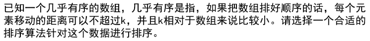

- idea：
  - say k = 4
  - 那么就先把前四个建立成小根堆
    - 【循环】
    - 第一个就是最小的，pop
    - 第五个放在最上，再 heapify， push
  - 直到没有数了，一个一个pop
    - **难点**: heap = [465], 怎么一个一个pop？
      - res.append(heap[0])
      - last = heap.pop()
      - heap[0] = last
      - heapify(heap, 0, len(heap))
- 复杂度
  - **时间：O( N * log K )**
    - 循环： N
    - heapify： log K

- 代码：

  - ```python
    import heapq
    # 利用heapq
    def heapq_nearly_sort(l, k):
        # make a heap
        a = l[:k]
        heapq.heapify(a)
    
        # add one pop one
        res = []
        p2 = k
        while p2 < len(l):
            res.append(heapq.heapreplace(a, l[p2]))
            p2 += 1
    
        # pop all
        while a:
            res.append(heapq.heappop(a))
    
        return res
    
    --------------------------------------------------------
    
    ## 纯手写
    def heap_nearly_sort(l, k):
        '''
        :param l:小根堆！
        :param k:
        :return:
        '''
        # all in: insert 和 heapify 二选一
        for i in reversed(range(k)):
            # 0, 1, 2, 3
            l = heapify_small(l, i, k)
    
        # plus
        heap = l[:k]
        p2 = k
        res = []
        while p2 < len(l):
            # pop
            res.append(heap[0])
            heap[0] = l[p2]
    
            # push
            heap = heapify_small(heap, 0, k)
            p2 += 1
    
        # all pop
        while True:
            res.append(heap[0])
            # maintain
            temp = heap.pop()  # pop the last
            if heap:
                heap[0] = temp  # make last the first
                heap = heapify_small(heap, 0, len(heap))  # do insert
            else:
                break
    
        return res
    
    
    def heap_insert_small(l, index):  # mod to 小根堆
        '''
        l = 数组/heap
        index = 这个insert得数字所在的位置
        *放在最后，往上看爹
        '''
        father_index = int((index - 1) / 2)
        while l[index] < l[father_index]:
            l[index], l[father_index] = l[father_index], l[index]
            index = father_index
            father_index = int((index - 1) / 2)
        return l
    
    
    def heapify_small(l, index, heap_size):  # mod to 小根堆
        '''
        l = 数组/heap
        index = 这个新换来的得数字所在的位置
        heap_size = len(l)
        *放在最上，往下看孩子
        return： l
        '''
        left_child = 2 * index + 1
    
        while left_child <= heap_size - 1:
    
            # 1. find small among left/ right
            left = l[left_child]
            right_child = 2 * index + 2
            if right_child <= heap_size - 1:
                # right child exist
                if left < l[right_child]:
                    largest = left_child
                else:
                    largest = right_child
            else:
                # right child NOT exist
                largest = left_child
    
            # 2. find biggest among left/ right / father
            father = l[index]
            if father <= l[largest]:
                largest = index
    
            # 3. 最大的不是父亲就得swap
            if largest != index:
                l[index], l[largest] = l[largest], l[index]
                index = largest
                left_child = 2 * index + 1
            else:
                # 3. 最大的是父亲就得停
                break
        return l
    
    D = heap_nearly_sort([2,3,0,1,5,4,6], 3)
    print(D)
    ```


