# 贪心算法

一般都很短，证明各异但是有统一办法

## 蒙题方法 - 对数器

一般情况：

- 举反例杀死错误得方法
- 永远不要想办法去证明他是对的因为来不及
- 用对数器去验证

笔试情况：

1. 实现一个不依靠贪心策略得解法X，可以选择最暴力得最慢的
2. 脑补出贪心策略A，B，C，。。。。
3. 用解法X和贪心策略，用实验的方式，得知哪个是正确的。
4. 不要纠结贪心策略得证明

## Q1 会议排时间

**问题**：一段时间内，安排得会议越多越好

- Input： 

  - list of 会议 = l

  - 一段时间得起始时间 = T

- output：
  - 最多安排几个p

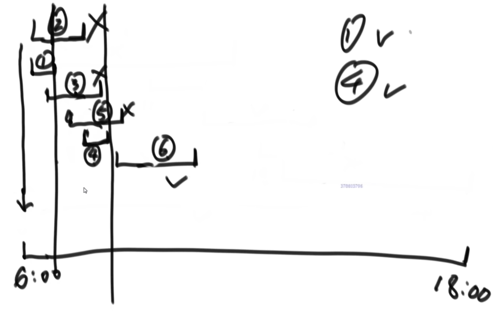

**算法**

1. 定义比较器cmp
   - p1.end - p2.end
2. 应用比较器 使 l 按照 会议结束时间 从早到晚排序
3. 从早到晚遍历所有的会议
   - 如果p得开始时间在 T 之后：
     - res+=1
     - T = p.end
   - 如果p得开始时间在 T 之前：
     - 忽略

4. return res

## Q2 字典序

**字典序**：

- 长度一样：
  - abc < bck
- 长度不一样，就补齐再对比：
  - b 和 apple
  -  = b0000 和 apple
  - b < apple

- 例子：
  - bc > bas

**问题**：

可以自由拼接给予的字符串，要求结果字符串拥有最小的字典序

- input:
  - list of strings

- output：
  - 字符串

**策略1**：（！错误！）

- 把strings按照字典序排列，再直接接在一起
- 反例：b和ba，字典序b<ba, output = bba,但是正确的应该是bab.

**策略2**：(正确)

- 有两个string：a和b。 判断ab和ba谁小，谁小谁在前面。
  - 即：if ab<= ba, then ab, else ba
  - ab if ab<= ba else ba

**证明2是对的**：

- **证明有传递性** = 比较没有闭环：

  - 反例：
    - 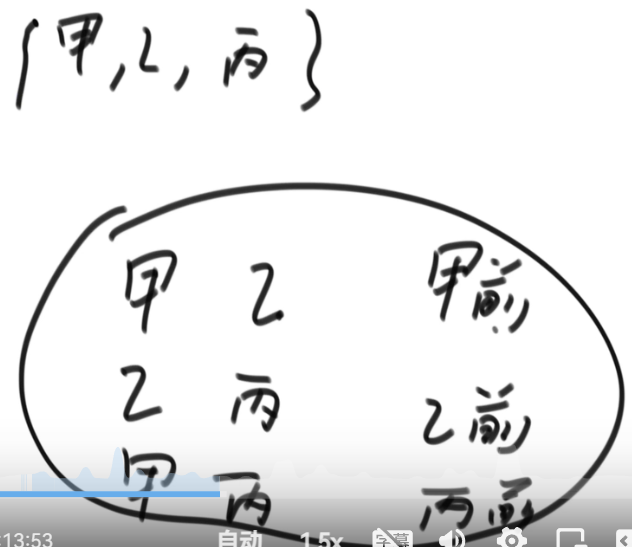

  - 目标：
    - 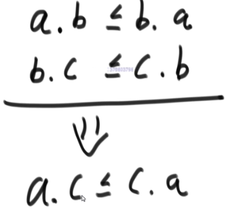

  - 点（。）是什么？是拼接。 我们把str想象为k进制得数，那么abc。de = abc*k^2 + de
    - 现在拼接运算变成了数学运算
    - 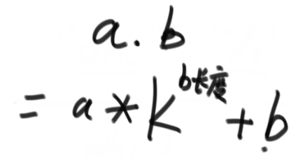

  - 定义m（x）：
    - 

  - 改写：
    - 

  - 折腾这辆不等式：
    - 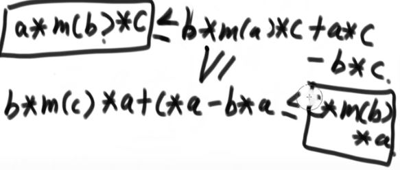
    - （3）=（（1）- b）* c 
    - （4）=（（2）-b） * a
    - （4）left <= （3）right
    - 化简得到

- **证明是字典序**：

  1. = 证明任何两个string，a和b，交换都会得到最大的字典序

  - 分类讨论：
    - a和b是连着的：
      - 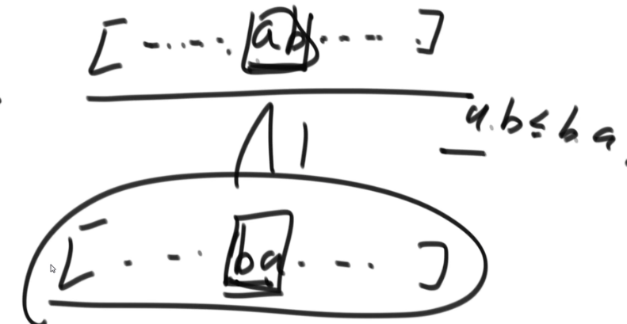
    - […, a,m1,m2,b,…] :
      - 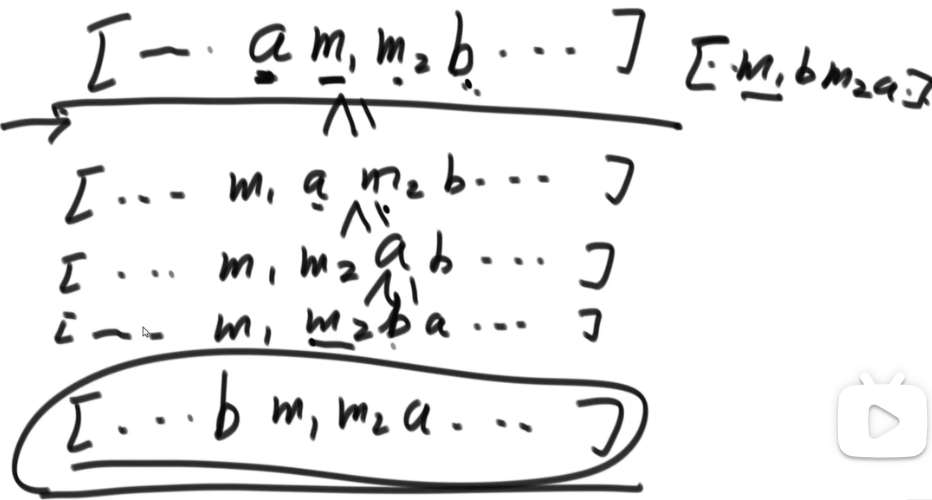

  2. = 证明任何3个string，a和b和c，交换都会得到最大的字典序 
  3. 4个string,5个string，…. [用数学归纳法]

## 实现技巧

1. 根据某标准 建立一个比较器 来排序（用cmp）
2. 根据某标准 建立一个比较器 来组成堆（用heapq）

 

## Q3 切金条

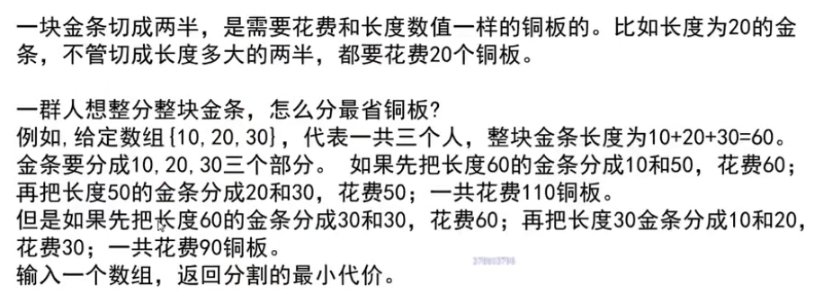

策略：

- 所有的数变成小根堆
  - 遍历+add
- while 堆得size > 1:
  - pop两个 = a，b
  - res += a+b
  - push（a+b）到堆里

- return sum

## Q4 做项目，资金，利润

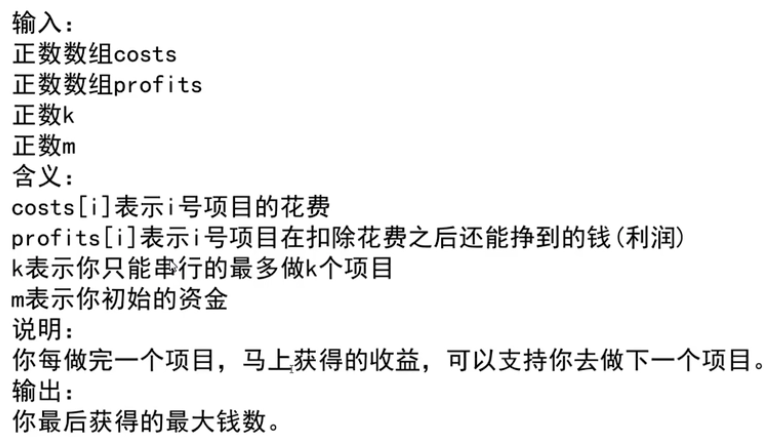

例子：

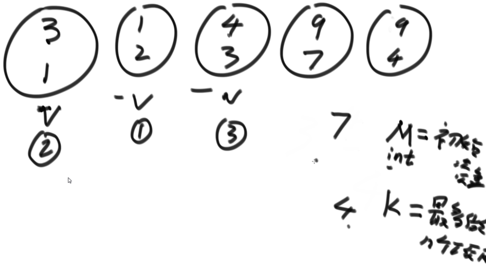

策略：

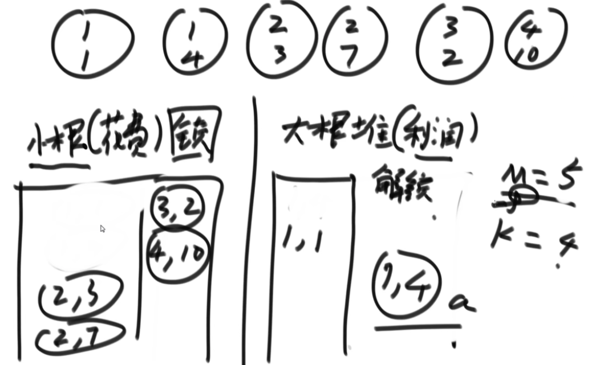

## Q5 高速返回中位数

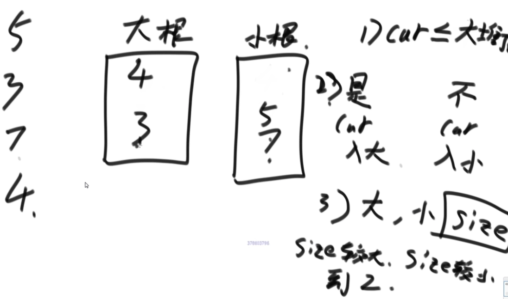

## Q6 N皇后

