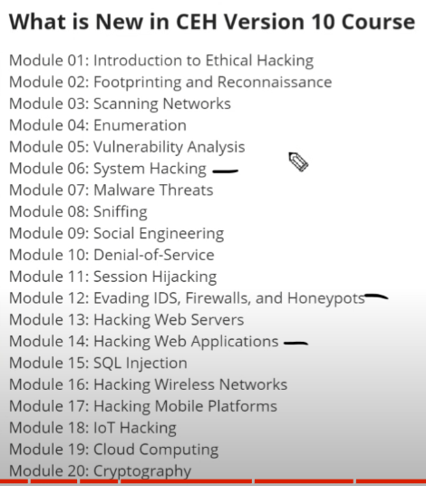

# Certified Ethical Hacker 

## Intro

**Black hat hacker:** 

- bad 

- does not have permission 

**White hat hacker:** 

- good 
- have permission 

**Gray Hat hacker:**

- grey area 

- no permission 
- no bad intension 
- illegal 

**Script kiddies:**

- Not a hacker, but a form of hacker officially 

- Using legit hacking tools, without understanding how they works 

**Hacktivists**:

- similar to  black hat hacker, without permission
- but with different intentions: eg.
  - over throw government  
  - over throw company with bad morals in their opinion 

- do good things but illegal 

**Terrorists**

**State-Sponsored**

- maybe sponsored by government 
- and infiltrate other government 

## The CEH (certified ethical hacker)

### Pre Reqs 

If you wanna work for the government, you have to pass it 

1. At least 2 years of IT security experience to enter the exam  
   - Application cost 100 美元 even if you are not qualified.

OR

1. Pay for their course: $850 美元

For the test itself: (no training material)

2. 1199 美元 on Pearson 

OR

2. 950 美元 on EC-Council 

### C|EH ANSI (more theory)

why are we hacking 

how are we hacking 

how it works 

### C|EH (Practical)

eg: 20 cases of hacking 

### Are you ready for the CEH?

**Key** 

- networking 
- basic security 
- basic sys admin (linux, windows,apple, mobile)
- scripting/ programming 

**Study Tools** 

- Video 
  - ITPro.tv, CEH v10 
- Book
  - CEH Certified Ethical Hacker All-in-One Exam Guide, Fourth edition 
  - source: oreilly 
- Lab 
  - ITPro.tv

- Practical Exam

What jobs can you get with the CEH??

- try indeed.com

Other Certifications!

- CISSP

- CISA
- CISM
- GPEN
- GWAPT
- GCIH
- GIAC
- OSCP
- CEH
- PCNSE