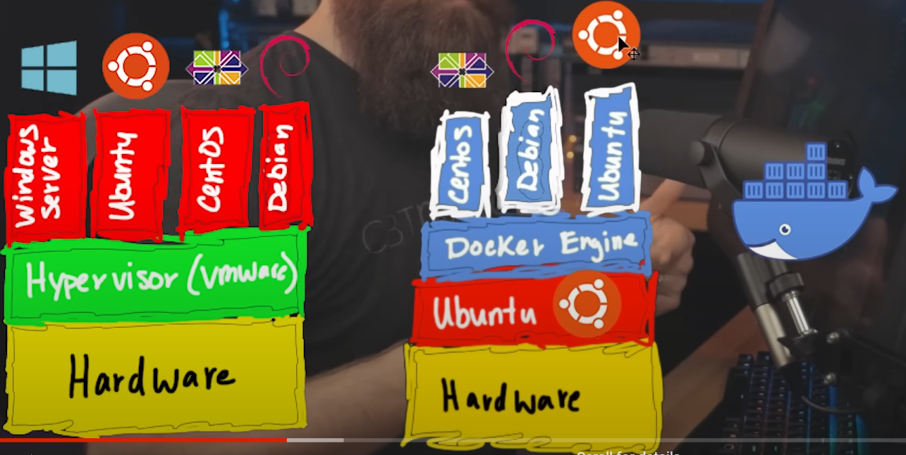

[TOC]

# Docker 

Dock is a 

Virtual Machine VS Docker 

- 

**Containers**

- = fast, light weight, micro computers 
  - micro computers = isolated fully functioning computer  

**why docker**

- an image contains: 
  - **everything** you need to run 
  - e.g. Debian-Linux, nginx, website files, all dependencies 

- Container is fast & light
  - because: they **use only one kernel** 

**key concept** of containers 

- **control groups** 
  - decide how much resource give to each container 

- **name spaces**
  - isolation achieved by this 

Containers **history**

- containers has been existed for really long time 

- docker is a company to develop them 

- there are other containers 

Create a image is complicated 

 

When we want to change containers content:

- we destroy the container 
- we modify the original image
- we create another container based on the new image 

Often 

- we run one application per container 
- we t micro 

## Setting/Download  

Optional:

- **Linode.com/networkchuck**
  - A cloud server provider 
    - others like: e.g. ASW, Google 

Download Docker on a linux system 

- `sudo apt update`
- `sudo apt install docker.io`

 

For WSL

- [Docker Desktop WSL 2 backend on Windows | Docker Documentation](https://docs.docker.com/desktop/windows/wsl/)

- download docker desktop for windows 

- NO:
  - `docker run -v /mnt/c/users:/users` (where `/mnt/c` is mounted from Windows)
- YES:
  - `docker run -v ~/my-project:/sources <my-image> ` where `~` is expanded by the Linux shell to `$HOME`

## Usage

1. find the image:
   - `docker pull <image_name>`
     - e.g. centos
   - pull from the **docker hub**  (A  registry of docker images)
   - Pull from hub using tag (version):
     - `docker pull <place>:<tag>`
     - `docker pull thenetworkchuck/nccoffee:frenchpress`

2. Run the docker container using this image 

   -  `docker run -d -t -p 80:80 --name <container_name> <image_name>`
   - `-d` = detach 
     -  Run container in background and print container ID
   - `-t` = tty
     - Allocate a pseudo-TTY (an abstract device in UNIX and *Linux*)

   - `-p 80:80` = publish list
     - Publish a container's port(s) to the host
     - first 80 is the host, second 80 is for the container 

3. Stop/Start the container 
   - `docker stop <container_name>`
   - `docker stop <container_name>`

- Check running docker containers  
  - `docker ps`

- Check the resource Usage

  - `docker stats`

- Connect to the container 

  - `docker exec -it <container_name> <shell>`
    - `docker exec -it myfirstContainer bash`

  - `-i` = interactive 
    - Keep STDIN open even if not attached
  - `-t` = tty
    - Allocate a pseudo-TTY

- Leave the container:
  - `exit`

- remove container 
  - `docker rm <container-name>`

- see your container working OS
  - `cat /etc/os-release`

# WSL2 

## Pre-setting

Only applies to ubuntu to change default DNS

1. stop and disable the `systemd-resolved.service` by:
   - `sudo systemctl stop systemd-resolved.service`
   - `sudo systemctl disable systemd-resolved.service`
2. See DNS
   - `sudo nano /etc/resolv.conf`

