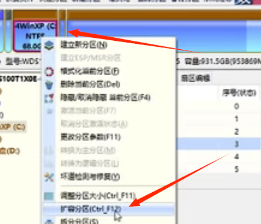
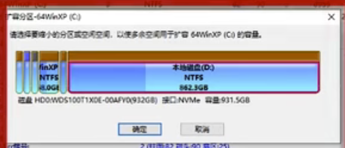
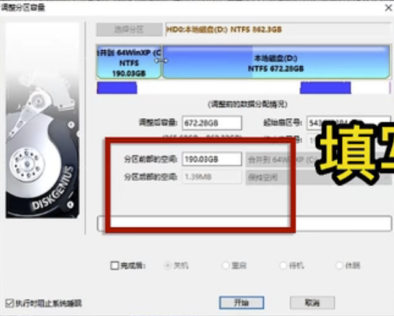

# 1. DiskGenius 下载

- 官网免费下载
- un zip and run the `DiskGenius.exe`
- read the protocal and say ‘I agree’
- 对着C盘点右键，选择： 扩容分区
  - 

- 弹出对话框，选择D盘（因为需要把D盘空间给C盘）
  - 
- 直接拖拽/手动输入
  - c盘本来的容量 = c
  - 扩容的容量/输入的容量 = a （我们输入的）
  - 最终c盘大小是 = c + a
  - 

- 选择‘开始’，“是”，“完成后重启”，“确定”

- 程序会创建一个pe， 并且重启，自动进入pe并且弹出工作，他自己干完活就会自动重启，done