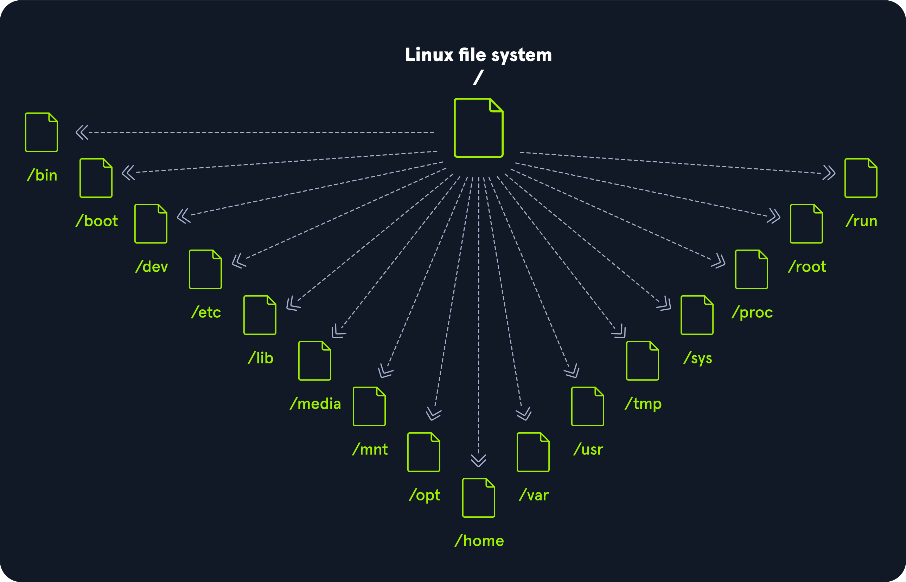

[TOC]

## Intro


### Linux Structure 


#### History 

1. Unix code owned by AT&T, 1970
2. Berkeley Software Distribution (BSD), 1977
3. GNU project,1983
4. GNU General Public License (GPL)
5. Linux kernel, 1991


**Distribution (distro)** 

- An operating system based on the Linux kernel and supporting software and libraries

- popular:
  - Ubuntu
  - Debian
  - Fedora
  - OpenSUSE
  - elementary
  - Manjaro
  - Gentoo Linux
  - RedHat
  - Linux Mint


**Linux Pros and Cons**

- ✔ more secure than other OS

- ✔ very stable and high performance to the end-user 
  - web servers are often based on Linux

- ❎ difficult for beginners 
- ❎ does not have as many hardware drivers


**Linux feature**

- free and open source 
- Linux-based OS run on servers, mainframes, desktops, embedded systems
  - eg: routers, televisions, video game consoles

- Android OS is based on the Linux kernel


**OS**

- is software that **manages** all of the **hardware resources** associated with our computer. **manages** the whole **communication** between software and hardware
- eg: Linux, Windows, iOS, Android, or macOS


**Parrot OS**

- is a **Debian**-based Linux distribution that focuses on security, privacy, and development


#### Principles

| **Principle**                                               | **Description**                                              |
| ----------------------------------------------------------- | ------------------------------------------------------------ |
| Everything is a file                                        | All configuration files for the various services running on the Linux operating system are stored in one or more text files. |
| Small, single-purpose programs                              | Linux offers many different tools, which can be combined to work together. |
| Ability to chain programs together to perform complex tasks | Enable us to carry out many large and complex tasks, such as processing or filtering specific data results. |
| Avoid captive user interfaces                               | work mainly with the shell (or terminal), which gives the user greater control over the operating system. |
| Configuration data stored in a text file                    | An example of such a file is the `/etc/passwd` file, which stores all users registered on the system. |


#### Components

| **Component**     | **Description**                                              |
| ----------------- | ------------------------------------------------------------ |
| `Bootloader`      | A piece of code that runs to guide the **booting process** to start the operating system. Parrot Linux uses the **GRUB** Bootloader. |
| `OS Kernel`       | The kernel is the main component of an operating system. It **manages** the resources for **system's I/O devices** at the **hardware level.** |
| `Daemons`         | **Background services** are called "daemons" in Linux. Their purpose is to **ensure** that key functions such as **scheduling, printing, and multimedia** are working correctly. These small programs **load after we booted** or log into the computer. |
| `OS Shell`        | The **operating system shell** or the **command language interpreter** (also known as the **command line**) is the interface between the OS and the user. This interface allows the user to **tell the OS what to do**. The most commonly used shells are **Bash, Tcsh/Csh, Ksh, Zsh, and Fish**. |
| `Graphics server` | This provides a graphical sub-system (server) called "**X**" or "**X-server**" that **allows** graphical programs to **run** locally or remotely on **the X-windowing system**. |
| `Window Manager`  | Also known as a **graphical user interface (GUI)**. There are many options, including **GNOME, KDE, MATE, Unity, and Cinnamon**. A desktop environment usually has several applications, including file and web browsers. These allow the user to access and manage the essential and frequently accessed features and services of an operating system. |
| `Utilities`       | Applications or utilities are **programs that perform particular functions** for the user or another program. |

- OS Kernel
- Daemons
- Shell
- Graphics Server
- Window Manager
- Utilities 


#### Architecture/ Layers

| **Layer**        | **Description**                                              |
| ---------------- | ------------------------------------------------------------ |
| `Hardware`       | **Peripheral devices** such as the system's **RAM, hard drive, CPU**, and others. |
| `Kernel`         | The **core of** the Linux **o**perating **s**ystem whose function is to **virtualize and control common computer hardware resources** like CPU, allocated memory, accessed data, and others. The kernel gives each process its own virtual resources and prevents/mitigates conflicts between different processes. |
| `Shell`          | A command-line interface (**CLI**), also known as a shell that a user can enter commands into to execute the kernel's functions. |
| `System Utility` | Makes available to the user all of the operating system's functionality. |


#### File System Hierarchy

- Tree-like hierarchy

- documented in the [Filesystem Hierarchy](http://www.pathname.com/fhs/) Standard (FHS)




| **Path** | **Description**                                              |
| -------- | ------------------------------------------------------------ |
| `/`      | The top-level directory is **the root filesystem** and contains all of the files required to boot the **operating system** before other filesystems are mounted as well as the files required to boot the **other filesystems**. After boot, all of the other filesystems are mounted at standard mount points as subdirectories of the root. |
| `/bin`   | Contains essential **command** binaries.                     |
| `/boot`  | Consists of the **static bootloader**, **kernel executable**, and **files required to boot** the Linux OS. |
| `/dev`   | Contains **device files** to facilitate access to every hardware device attached to the system. |
| `/etc`   | Local **system configuration** files. **Configuration files for installed app**lications may be saved here as well. |
| `/home`  | Each **user** on the system has a subdirectory here for **storage**. |
| `/lib`   | **Shared library files** that are required for system boot.  |
| `/media` | **External removable media devices** such as USB drives are mounted here. |
| `/mnt`   | **Temporary mount point** for regular filesystems.           |
| `/opt`   | **Optional files** such as third-party tools can be saved here. |
| `/root`  | The home directory for the root user.                        |
| `/sbin`  | This directory contains **executables used for system administration** (binary system files). |
| `/tmp`   | The operating system and many programs use this directory to **store temporary files**. This directory is generally cleared upon system boot and may be deleted at other times without any warning. |
| `/usr`   | Contains **executables, libraries, man files, etc**.         |
| `/var`   | This directory contains **variable data files** such as log files, email in-boxes, web application related files, cron files, and more. |


### Intro Shell

**A Linux terminal** 

- a `shell` 
- a command line


**console**

- refer to a screen in text mode
- not a window


#### Terminal Emulators

- is software that emulates the function of a terminal
- It allows the use of text-based programs within a graphical user interface (`GUI`)
- different terminal emulators:
  - **GNOME** Terminal, 
  - **XFCE4** Terminal, 
  - **XTerm**


**Multiplexers**

- command-line interfaces that run as additional terminals in one terminal 
- eg：
  - Tmux
  - GNU
  - Screen

**Key**

- Terminal serves = interface to the shell interpreter
- Terminal emulators and multiplexers = beneficial extensions for the Terminal
  - provide us with different methods and functions to work with the terminal, #
  - such as:
    - splitting the terminal in one window, 
    - working in multiple directories, 
    - creating different workspaces


⬆ How `Tmux` works (a multiplexer)


**Bourne-Again Shell (BASH)**

- The most commonly used shell in Linux 
- is part of the GNU project
- other shell:
  -  [Tcsh/Csh](https://en.wikipedia.org/wiki/Tcsh), 
  - [Ksh](https://en.wikipedia.org/wiki/KornShell), 
  - [Zsh](https://en.wikipedia.org/wiki/Z_shell), 
  - [Fish](https://en.wikipedia.org/wiki/Friendly_interactive_shell)


## The Shell

### Prompt Description

- <`~`> = The home directory for a user

- `$` = stands for a user
- <`#`> =  stands for root

```shell-session
Format:
<username>@<hostname><current working directory>$

Example:
<username>@<hostname>[~]$
root@htb[/htb]#
```


The [bashrcgenerator](http://bashrcgenerator.com/) and [powerline](https://github.com/powerline/powerline), which gives us the possibility to adapt our prompt to our needs


### Get Help

Detail of a tool:

>  `man <tool>`


Examples of a tool : 

> `<tool> –-help`
>
> `<tool> –h`


Description of a given keyword 

> `apropos <keyword>`


Explain a long command:

- https://explainshell.com/


### System Information

Tools:

| **Command** | **Description**                                              |
| ----------- | ------------------------------------------------------------ |
| `whoami`    | Displays current username.                                   |
| `id`        | Returns users identity                                       |
| `hostname`  | Sets or prints the name of current host system.              |
| `uname`     | Prints basic information about the operating system name and system hardware. |
| `pwd`       | Prints working directory name.                               |
| `ifconfig`  | The ifconfig utility is used to assign or to view an address to a network interface and/or configure network interface parameters. |
| `ip`        | Ip is a utility to show or manipulate routing, network devices, interfaces and tunnels. |
| `netstat`   | Shows network status.                                        |
| `ss`        | Another utility to investigate sockets.                      |
| `ps`        | Shows process status.                                        |
| `who`       | Displays who is logged in.                                   |
| `env`       | Prints environment or sets and executes command.             |
| `lsblk`     | Lists block devices.                                         |
| `lsusb`     | Lists USB devices                                            |
| `lsof`      | Lists opened files.                                          |
| `lspci`     | Lists PCI devices.                                           |


#### Tool: Id

My Linux:

```
─$ id

uid=1000(rory) gid=1000(rory) groups=1000(rory),4(adm),24(cdrom),27(sudo),30(dip),46(plugdev)
```

Case:

```
cry0l1t3@htb[/htb]$ id

uid=1000(cry0l1t3) gid=1000(cry0l1t3) groups=1000(cry0l1t3),1337(hackthebox),4(adm),24(cdrom),27(sudo),30(dip),46(plugdev),116(lpadmin),126(sambashare)
```

- `1337(hackthebox)`
  - it is non-standard 

- `4(adm)`
  - `adm` group can read log files in `/var/log`

- `27(sudo)`
  -  `sudo` group can run some or all commands as the all-powerful `root` user
  - escalate privileges


#### Tool: uname

- **the flag `-a` will omit `-p(processor type)` and `-i(hardware platform)` if they are unknown **

My Linux:

```
└─$ uname -a

Linux DESKTOP-5BS45RG 5.10.16.3-microsoft-standard-WSL2 #1 SMP Fri Apr 2 22:23:49 UTC 2021 x86_64 GNU/Linux
```


Their Linux:

```
cry0l1t3@htb[/htb]$ uname -a

Linux box 4.15.0-99-generic #100-Ubuntu SMP Wed Apr 22 20:32:56 UTC 2020 x86_64 x86_64 x86_64 GNU/Linux
```

| Explain                   | mine                               | their                                        |
| ------------------------- | ---------------------------------- | -------------------------------------------- |
| **kernel name,**          | Linux                              | Linux                                        |
| **hostname,**             | DESKTOP-5BS45RG                    | box                                          |
| **the kernel release,**   | 5.10.16.3-microsoft-standard-WSL2  | 4.15.0-99-generic                            |
| **kernel version,**       | #1 SMP Fri Apr 2 22:23:49 UTC 2021 | #100-Ubuntu SMP Wed Apr 22 20:32:56 UTC 2020 |
| **machine hardware name** | x86_64                             | x86_64 x86_64 x86_64                         |
| **operating system**      | GNU/Linux                          | GNU/Linux                                    |


### Tool: SSH login

**SSH def**

- **Secure Shell**
- **a protocal** that allows clients to access and execute commands or actions on remote computers
- one of the **permanently installed** standard tools 
- the preferred choice for many administrators to **configure and maintain** a computer **through remote access**


**SSH features**

- NO GUI
- very efficiently
- occupies very few resources


**SSH Usage**


```
Format:
<username>[/htb]$ ssh [username]@[IP address]
```


##### Learned from questions 

- user email is in `/var/mail/<user name>`, but it is only visible to administrator
  - Info get in 2 ways:
    - Easy: `env | grep MAIL`
    - Difficult: `cat /etc/passwd | grep mail`


##### Supplement knowledge1


**Unix-like operating system**:

- AIX, HP-UX, Solaris, and Tru64


**Open-source** Unix-like operating systems:

- those based on the Linux kernel and BSD derivatives, 
  - such as FreeBSD and OpenBSD


**BSD**

- = The Berkeley Software Distribution or Berkeley Standard Distribution
- = a discontinued operating system based on Research Unix


**BSD derivatives**

- commonly refers to BSD descendants, 
- including FreeBSD, OpenBSD, NetBSD, and DragonFly BSD


**VPN Servers** 

- ‘switch VPN’ means your connection keys are regenerated and you must re-download your VPN connection file


## Workflow

### Create files 


**touch**

- `touch <file_name1> <file_name2> <file_name3>`
  - create 3 empty files 
  
  


**cat**

- `cat >file_name.txt`
  - then type things inside 
  - end by `Ctl + D`

- `cat << EOF > file.txt`
  - EOF = End Of File
    - Anything can substitute the EOF
  - then type things inside 
  - end by type EOF + Enter


**echo**

- `echo "contents...." > file.txt`
  - write content into a new file
  - if the file.txt already exist, OVERWRITE the content 


### Directory

- When you do `ll` / `ls -l`
- `-rw-r--r-- 1 rory rory    0 Nov 16 10:10 cannottouchthis.txt `
  - this is a file, as the first letter is **-**

- `drwxr-xr-x 2 rory rory 4.0K Nov 16 10:26 coolstuff`
  - this is a directory, as the first letter is **d**


**mkdir**

- `mkdir <dir_name> <dir_name> <dir_name>`

- `mkdir -p <dir_parent>/<child_name>/<child_name>`
  - make directory with parent and child  


### Move and Copy

**mv**

- move
  - can do change in place and rename at the same time 
  - this will delete the original file 
  - move lots of files at the same time
  - move directories to another directories 

- `mv <file_to_move> <where_to_go>`
  - e.g. `mv file.txt ./coolstuff` or `mv file.txt coolstuff` or `mv file.txt coolstudff/`
  - absolute path VS relative path 
  - `./` = this directory
  - `.` = this 
  - `/` = root directory

- `mv <file_to_move> <where_to_go>/<new_name>`
  - `mv sherlock.txt ./rory/john.txt`

- `mv file1 file2 file3 <place>`
  - `mv temp.txt touch.txt file_name.txt  cannottouchthis.txt ./coolstuff/`

- `mv  dir1 ./parent/child`


**cp**

- copy
  - can do change in place and rename at the same time 
  - this will not delete the original file 

- `cp file.txt file.txt.bak`
  - back up to the same directory
  - **.bak** = extension for back up files

- `cp file.txt <palce>/<new_name>`
  - `cp cant coolstuff/can`

- `cp -r dir ./parent/child`
  - recursively move all the files 


### Observe 

**ls**

- `ll, la, ls -l, ls -al`
- `ls <path>`
  - e.g. `ls ./coolstuff`, `ls coolstuff`


**tree**

- see the structure of the current working directory 


### Remove and Destroy 

**rm**

- remove files

- `rm <file_name> <file_name> <file_name>`


**rmdir**

- remove directories
- `rmdir <dir_name>`
  - empty directory
- `rm -r <dir_name>`
  - remove not empty directory
  - -r to make sure remove all files inside it


### Break the Linux System 


**Remove as many file as possible** to break the system 

- do `sudo rm -rf --no-preserve-root /` (NEVER DO THIS)
  - -r recursively 
  - -f forcefully 
    - ignore all warning 
  - —no-preserve-root
    - do not treat `/` specially 


**Add as many file as possible** to break the system

- do `mkdir -p ./parend/child/child/child/child/child/child/....`

- write a `.sh` file by `nano anotherone.sh`:

  - ```.sh
    #!/bin/bash
    
    for i in {1..1500}
    do
    	mkdir -p ./$i/parend/child/child/child/child/child/child/....
    
    done
    ```

- run the script:

  - `bash notherone.sh `

- boom! Done!!!

- To reverse del all created directories:

  - 

    ```
    #!/bin/bash
    
    for i in {1..1500}
    do
            rm -r ./$i
    
    done
    ```

    


## Easy Command - time saving

Always use `man <command>` to check the help

> `uname -a ` gives the current kernel and OS info


**cd**

- `cd ` 
  - back to home directory 
- `cd ../..`
  - back 2 directory

- `cd -`
  - back to the last directory 
  - look at `$OLDPWD`


**ls**

- `ls -l`
  - list in order
- `ls -al`
  - list all hidden files 

- `ll`
  - list in order
- `la`
  - list all hidden files


**alias**

- temporal - disappear when logout
  - `alias <new_command_name>="<command>"`
  - e.g. `alias lumos="ls -al"`, then `lumos`
- permanent 
  - `sudo nano .bashrc`
  - add `alias <new_command_name>="<command>"`


**sudo**

- forget? type `sudo !!`


`Tab Tab`

- see suggestion 


`Ctl + +` zoom in

`Ctl + -` zoom out


**Command**

`Ctl + Shift + C` Copy 

`Ctl +Shift +V` Paste


`Ctl + A`  to the inital 

`Ctl + E`  to the end 


`Ctl + U` Cut everything **before** the curser

`Ctl + K` Cut everything **after** the curser

`Ctl + Y ` Paste 


`ALT + BACK` cut the word before

`Ctl + X + E` Edit in nano editor 


**Log file**

e.g.  /var/log/auth.log


`less /var/log/auth.log` 

- log part by part


`tail <file>`

- see only the last 10 lines 


`sudo tail -f <file>`

- live monitor log


**Command history**

`Ctl + R` revers search command 

- `right arrow` bring the selected command back
