[TOC]

# CCNA

## 零. Intro - 1 PC to 1 PC 

### 1 Through Internet

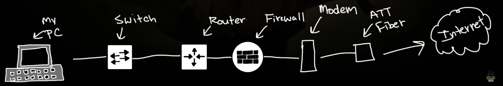

A high over view of 1 PC to another 1 PC through internet 

- **LAN**
  - PC -> Switch -> Router ->Firewall -> Modem -> ATT Fiber -> Internet

- **WAN** / Internet

  - Router -> Router -> Router -> …. -> Router -> The Server
    - Switches, Firewalls… are inside the route somewhere

  - The Server -> Router -> Router -> …. -> Router -> Other Players House
    - Switches, Firewalls… are inside the route somewhere

- **LAN** 
  - Internet -> ATT Fiber -> Modem -> Firewall -> Router -> Switch -> PC

- **->** means 
  - Ethernet Cable / ATT Fiber 

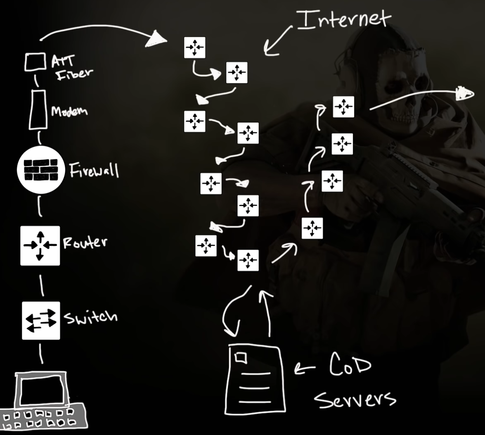

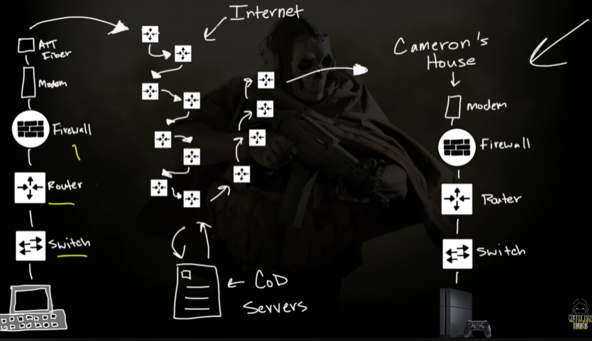

### 2 Through Ethernet

From Small to Big

- Only Cables:
  - 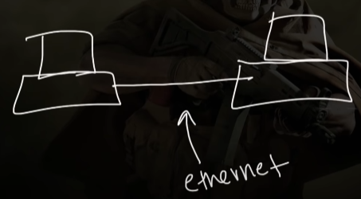

- With Switches 
  - 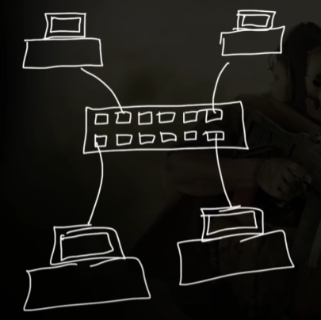

- With Routers:
  - 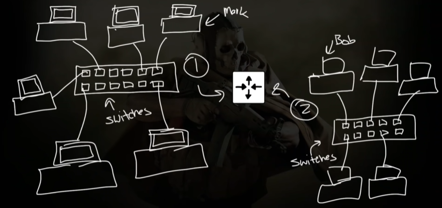

- Through internet 
  - 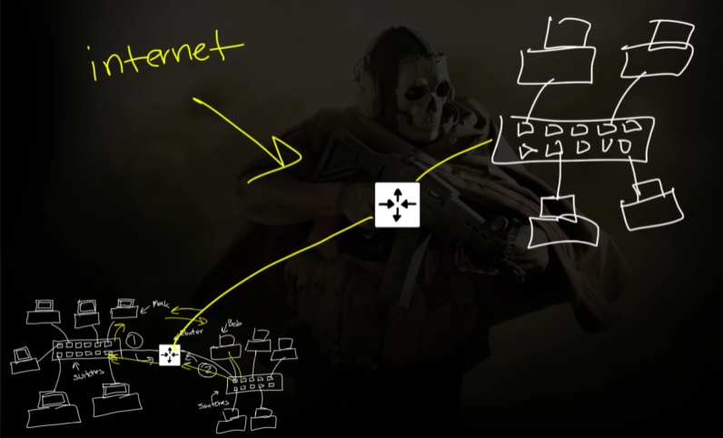

### 3 WAP

Wireless Access Point

- Usually the switch provide it
  - The router and modem could provide this also 

- **c** the network over **Airways** 

### 4 Home 

- often **One device** can do the job of:
  - modem + firewall + router + switch + WAP

## 一. Switch - Layer 2

### 1 CISCO Packet Tracer 

- download page: [Cisco Skills For All](https://skillsforall.com/resources/lab-downloads)

Why use packer tracer? 

- it can slow down the communication
- we can watch what happened **step by step** 

#### ->Usage

**Import** example:

- File -> Open -> D:\CCNA\day1\ccna_day1.pkz 

**View** hub

- Physical-> Home City -> Corporate Office -> Main Writing Closet
  - it shows switch & hub 

**Ping** 

- click picture -> desktop -> Command Prompt 
- `ping <IP>`
  - do one step 
  - 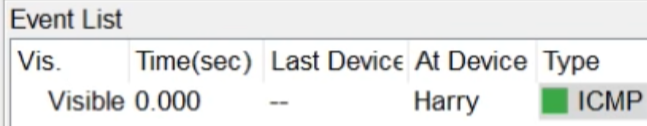

**Realtime / Simulation** 

- execution mode 

**Command** Switch:

- click switch -> click CLI -> click Enter -> give Cisco Command 

  - `enable`

  - `show mac-address-table`

### 2 Concept

#### -> **Layers**

- Layer 3: 
  - **IP**,

  - **Packet**

- Layer 2: Datalink layer 
  - **Switch**

  - **Frame**/Packet 

- Layer 1:
  - **Physical Cables**/Wires, 
  - **electrical signals** 

#### -> **Hub**

- dumb/stupid! 
  - it send the message to everybody 

#### -> **Switch** 

- **Generally**:
  - has a brain!
  - it send the message to the exact person 

- **Naming**

  - **Port** name: e.g. 
    - Fa 0/1
    - Fa 0/2
    - …
  - **CAM table** 
    - Content Addressable Memory
    - 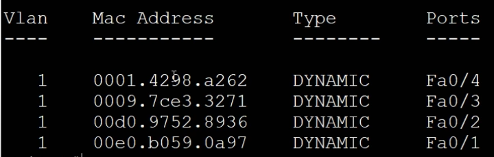
  - **MAC address** 
    - The burned in address / it ever change 
    - one device only have one during life time 
      - unique
    - e.g. 00D0.9752.8936

- **Job**:

  - can only see/use **MAC address** 

  - **Destination MAC address:** 
    - switch use to make **forwarding decisions**

  - **Source MAC address**: 
    - Populate the **CAM table**

Switch has many **sizes**, e.g.:

- 8 port 
- 48 port

#### -> **Wireless**

- Doing job like switch, but… 
  - **broadcast** to everyone who connect to the WAP

- **WAP** (Wireless Access Point)
  - could connect to the switch by wire
  - send to device by airway

## 二. Router 

### 1. Network

What is a network? 

- A group/range of IP address 
  - e.g. 
    - 10.1.1.0 - 10.1.1.225 = 10.1.1.1.0/24
    - 23.227.38.01 - 3.227.38.225 = 3.227.38.0/24
- Devises connected by a switch (no router involves)

- Network Examples:

  - 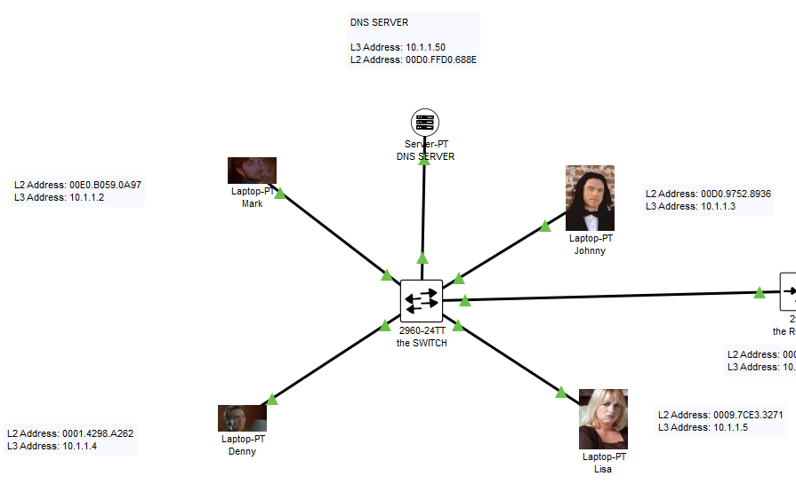

  - 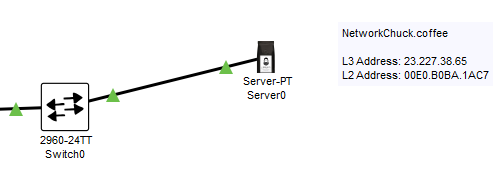

  - 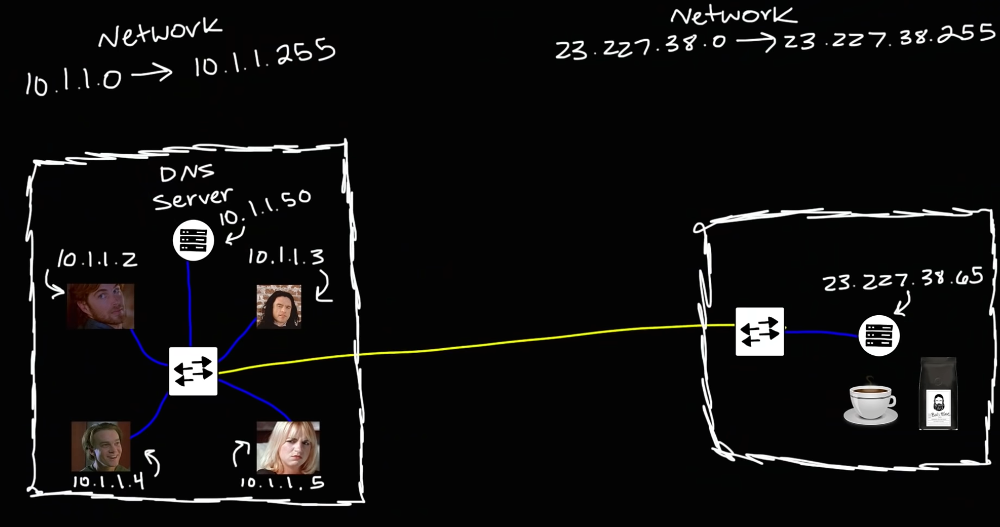

### 2. Router 

What is Router

1. Helps the communication of networks / connect networks 
   - link between switches 

2. Remember the map to other networks 

   - To view the table 

     - router -> CLI -> Enter

     - `enable`

     - `show ip route`

   - The Table shows: IP, port/interface 
     - 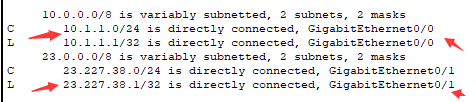

- shape and size:

  - e.g. 

    - 

    - 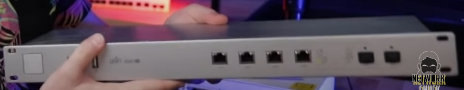

Real World Routing:

- inside a route-server, enter command 
- `show bgp ipv4 unicast`
  - bgp: a routing protocol 

- returns routs to different networks in the internet 
- The Table/Map often extremly long
  - 

Why we need a Router at all? 

- connect switch to switch with a cable sounds ok, why we connect switch to router?
  - It will not work! Check out the mechanism! 

### 3. A Ping B on Same network

Say A: ping 10.1.1.2 (B)

1. If don’t know the MAC address,
   - Do a ARP request 

2. Ping this MAC address
   - Do a ICMP 

Why A need B’s MAC address to communicate? 

- because: 

  - switches only speak L2: MAC address and Frames

  - devices only speak L3: IP address and Packet 

  - With only the knowledge of IP address, we cannot communicate on L2 / the network level

What is ARP? 

- Address Resolution Protocol 
- Talks ARP packet 
- how A finds out the 10.1.1.2’s MAC address 

A Broadcast Address:

-  FFFF.FFFF.FFFF
- L2 switch says to everybody: Who has this specific IP address? 

How A learn B MAC address?

- The ARP process constructs a request for the target IP address.
  - A send the Frame to find the MAC
  - 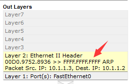

- The Switch receive the ARP address:
  - Broadcast to everybody / all ports he connected to
  - 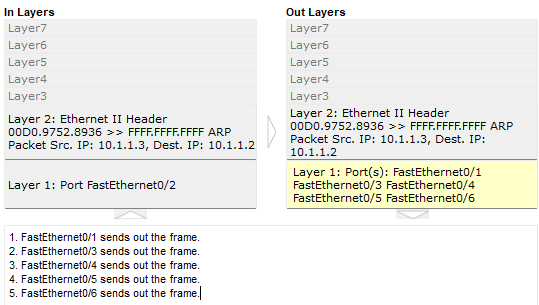

- Devices (C,D,E …) not this IP 
  - drop the frame
- Devices (B) match this IP 
  - send a frame for response with its MAC address 

- The response goes to the switch and goes to the A 

### 4. A Ping B on Different network

Say A: ping 23.227.38.65 (Coffee Server)

1. If don’t know the MAC address,
   - Do a ARP request 

2. Ping this MAC address
   - Do a ICMP 

Gateway 

- people -> config -> Gateway -> Static Dateway

- Gateway is an IP address for the router 
- 10.1.1.1

1. 

How A learn R (the router) MAC address?

- A’s  sends a ARP request Frame:

  - Dest IP is 10.1.1.1/ gateway
    - 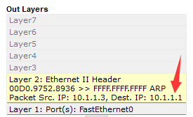 

  - because A knowns the Coffee server is not on his network
  - A is not Trying to find Coffee on his network 

- Switch Broadcast: who is 10.1.1.1/gateway ?
- Devices (B,C,D,E …) not this IP 
  - drop the frame
- Devices (R) / Router match this IP 
  - send a frame for response with its MAC address 

- The response goes to the switch and goes to the A 

2. 

The A send the frame and package to the Router using its MAC address

3. 

The Router (L3) 

- then receive the package from its port / interface 
  - say, port / interface GigabitEthernet0/0
  - Router learns the Message and the Dest IP address 
    - 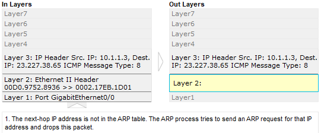

- Router Broadcast with an ARP request: who is this 23.227.38.65?
- The switch receives this, and continue broadcast with an ARP request: who is this 23.227.38.65?
- The Coffee server receives this, and reply with its MAC Address 

- The replay goes from Coffee to Switch to Router 
- by now, everybody knows everybody 

4. 

The A send its actually message to Coffee server 

- The actually message A send:
  - on L3: Src: his IP, Dest: Coffee server IP
  - on L2: Src: his MAC, Dest: Router MAC
  - 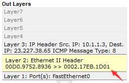

- finish the A -> switch -> router 
  - Massage of the Router:
  - L2: MAC address of the Coffee server
  - 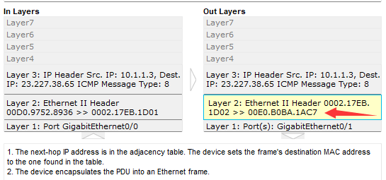
- finish the router -> switch -> B 

- then B reply goes -> switch -> router -> switch -> A

### 5. A Request B on Different network

DNS Server

- Domain Name Service Server
- Change the Name (www. xxx .com) into IP address (123.12.12.4) 

- people -> config -> DNS IPv4 -> Static DNS Server

A: I want to visit NetworkChuck.coffee, 

- A: I must find the IP of this Name, so I must first find the DNS server.  

- A: Check the IP of DNS Server
- A: Oh, DNS is on the same network 
- A: Send an ARP request to find the MAC address of the DNS server
  - Process just like A ping B on Same network
  - DNS Server reply its MAC address 

- A: Send a DNS query: Tall me IP of  NetworkChuck.coffee PLZ! 
  - DNS receives the query message and return with the IP address
  - 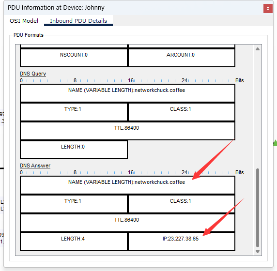
- A: send the HTTP request to 23.227.38.65
  - works just like A ping B on Different network

##  三. TCP/IP and OSI

### 1. History

- 1960s
  - IDEA: Let 2 computer communicate / share file 

- 1969
  - The birth of the First Network: ARPANET
  - US  DOD / department of defense made it 
  - it is very complex 
  - invented the idea: Packet switching
  - leave the question: How

- Companies designed/invented networks **proprietary** (only works with their own devices) 
  - e.g. IBM can only talk with IBM, not others companies' device
  - at that time, the ethernet cable does not exist, every company has their own cable/ports/etc…. 

- Feel stupid, Thus decide Unify and only use one networking model 
  - Long debate and negotiation process 
- TCP/IP and OSI networking model / standard 
  - how to connect 

### 2. Layers

Decompose the standards into layers 

**OSI (Open System Interconnect)**

- Application 7 
- Presentation 6
- Session 5
- Transport 4
- Network 3
- Data link 2
- Physical 1

Remember them 

- Top Down
  - All People Say They Never Download Porn

- Bottom Top
  - Plz Do Not Throw Sausages Pizza Away

**TCP/IP**

- Application 7 
- Transport 4
- Network 3
- Data link 2
- Physical 1

TCP/IP vs OSI

- OSI has additional 2 layers: Session and Presentation
- OSI loss, we constantly refers to it
- TCP/IP win,  everyone use, 

Example of layers 

- Application 
- Presentation
- Session 
- Transport 
  - TCP UTP Port Number
- Network 
  - Router, Ip address, packages
- Data link 
  - Switches, Mac address, frame 
- Physical
  - Ethernet cables 

### 3. Devices VS Layers 

- L3
  - router
- L2
  -  switch, bridges 
- L1-L2
  - WAP
- L1
  - hub, repeater

## 四. Real Life Example

### 0. Functions

**Encapsulation**

- Put inside an envelop

**De-encapsulation** 

- Put outside of an envelop 

Application Layer 7

- determine whether adequate resources exist for communication
- manage communication between applications
- directing data to the correct programe

Presentation Layer 6

- convert data to the correct data format 

Transport  Layer 4

- ensure error-free data delivery 
  - sounds TCP and reliable 

- **TCP / UDP**  (domain protocol)
  - TCP:
    - 3 way handshake 
    - reliable
  - UDP:
    - Faster 
- **Port number**
  - Port 443 - https
  - Port 80 - http

Data Link Layer 2

- managing logical and physical addressing
  - sounds MAC address 

**RARP**

- Reverse ARP
- Given MAC address, try to find IP address 

### 1. Example: 

- Say, A want to order Coffee by clicking enter in a browser

#### -> At A

- A: In the **application layer 7**:

  - The Web Browser try to access the Website 
  - The client sends a request to the server.
  - Using **HTTPS /HTTP** protocol 
  - takes out **Data** (Encapsulation)
  - 

  - Say: https

- A: Presentation Layer 6 and Session Layer 5 
  - Skip detail for now 
- A: **Transport Layer 4**
  - say: TCP and port 443
  - Finally-> add a **L4 Header** (Encapsulation)
  - **Segment**
  - 
- A: **Network Layer 3**
  - Src IP(A) and Dest IP(Coffee)
  - Finally-> add a **L3 Header** (Encapsulation)
  - **Packet**
  - 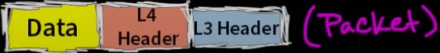

- A: **Data Link Layer 2**
  - Src MAC(A) and **Dest MAC(Router)**
  - Finally-> add a **L2 Tralier** and **L2 Header** (Encapsulation)
  - **Frame**
  - 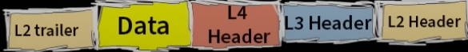

- A: **Physical Layer 1**
  - Fire through port!
  - Usually ethernet port

#### -> At Switch 

- De-encapsulation 
- See only the frame
- L1 and L2 info 

#### -> At Router

- De-encapsulation 

  - See only the Packet

  - L1, L2 and L3 info 

    - Check L2 MAC address correct 

    - Check L3 IP address, determine where to go

- Find the MAC Address of that Dest IP
  - ARP process omitted here
- Encapsulate Src IP(A) and Dest IP(Coffee), not change
- Encapsulate Src MAC(router) and **Dest MAC(Coffee)**

#### -> At Switch 

- De-encapsulation 
- See only the frame
- L1 and L2 info 

#### -> At Coffee Server

- Physical Layer 1
  - ethernate port receives
- Data Link Layer 2
  - Check the MAC address is correct
- Network Layer 3
  - Check the IP address is correct
- Transport Layer 4
  - Find using TCP at port 443
- Application layer 7
  - Find out using HTTPS
  - This is Browser / Website info

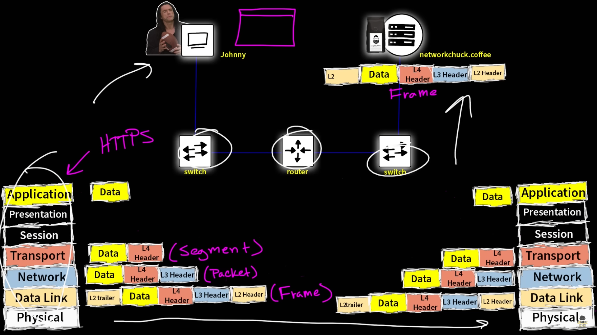

## 五. Upper Layers 7-4

### 1. Programmer Concept

Example: 

- A want to watch youtube videos 
- and A type the youtube.com and hit enter

#### -> Application 7

- The **Interface / Portal** for applications to communicate over a network

#### -> Presentation 6

- make the Data presentable with 2 aspect 

1. **Data Format**

   - = put data into a File type

   - e.g. 

     - document**.pdf** 
       - Adobe, Acrobat, Browse, … etc appplications can open it 

     - document**.aaaaaaa** 
       - Computer do not know how to  deal with it

   - In this case: probably contains 

     - document**.html** 
     - document**.xml**
     - document**.jpg**  

2. **Encryption**

   - Make sure the message you send cannot be seen by hackers 
   - e.g.
     - SSL (Secure Socket Layer)

#### -> Session 5

- maintain a conversation between A and B
  - make sure is authenticated 
  - conversation is smooth
  - keep communication open
  - if the conversation finished, the session is destroyed, end the conversation 

- Manage all communications between applications and servers 

- Commonly seen protocol:

  - **L2TP** 

    - Layer 2 Tunneling Protocol 
    - **VPN** connections use this 

  - **RTCP**

    - Real-Time Transport Control Protocol
    - Set up **phone** calls 

  - **H.245**

    - Control channel protocol used with[in] e.g. H.323 and H.324 communication sessions, and involves the line transmission of non-telephone signals

    - Set up **video** calls

  - **SOCKS**
    - **proxy**: who operate this layer 
    - Internet protocol that exchanges network packets between a client and server through a proxy server
    - **hackers** operate this layer, bouncy between different host to disguise who you are 

We done with the programmers things 

### 2. Network Concept

#### -> Transport 4

Start of the networking things 

Using protocols to transport things: TCP, UDP

##### TCP vs UDP

TCP: 

- Transmission Control Protocol 

- Reliable 

- Three-ways handshake:

  1. SYN = synchronization

  2. SYN ACK

  3. ACK = acknowledgement

UDP

- User Datagram Protocol
- Fast
- Keep on sending stuff 

Why use UDP at all?

- when doing real time, e.g. talk, video, gaming online
- when the time past, say 2 min, no need of the already missing info at 1 min.

##### Port

Port Number for different services

- port can be used by 
  - TCP
  - UDP
  - TCP or UDP

- Total available ports:
  - 0-65535

- Well-know ports:
  - 0-1023 are reserved 

- Ephemeral ports
  - temporary 

Common Key Ports:

| service | name                                      | port number              | TCP  | UDP  |
| ------- | ----------------------------------------- | ------------------------ | ---- | ---- |
| FTP     | File Transfer Protocol: data transfer     | 20                       | √    | —    |
| FTP     | File Transfer Protocol: control (command) | 21                       | √    | —    |
| SSH     | Secure Shell                              | 22                       | √    | —    |
| FP?     | Telnet protocol                           | 23                       | √    | —    |
| SMTP    | Simple Mail Transfer Protocol             | 25                       | √    | —    |
| DNS     | Domain Name System                        | 53                       | √    | √    |
| DHCP    | Dynamic Host Configuration Protocol       | 67 (server); 68 (client) | —    | √    |
| TFTP    | Trivial File Transfer Protocol            | 69                       | —    | √    |
| HTTP    | Hypertext Transfer Protocol               | 80                       | √    | —    |
| HTTP    | Hypertext Transfer Protocol               | 80                       | ×    | √    |
| SFTP    | Simple File Transfer Protocol             | 115                      | √    | —    |
| NTP     | Network Time Protocol                     | 123                      | —    | √    |
| SNMP    | Simple Network Management Protocol        | 161                      | —    | √    |
| HTTPS   | Hypertext Transfer Protocol Secure        | 443                      | √    | √    |
| RDP     | Microsoft Terminal Server                 | 3389                     | √    | √    |

##### Wireshark Example 

- capture an interface, say, ethernet 2
- visit youtube and play a video
- stop capture 
- filter only communication with the youtube 
  - `ip.addr == 173.194.191.167`

Youtube behavior: initially TCP, when play video, change to UDP 

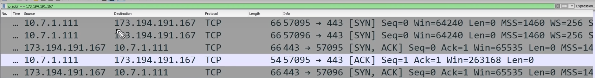

….

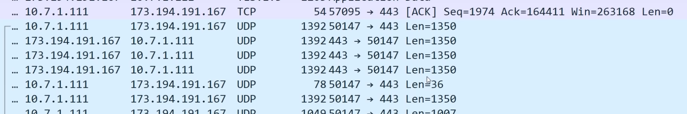

## 六. Design Network

### 

