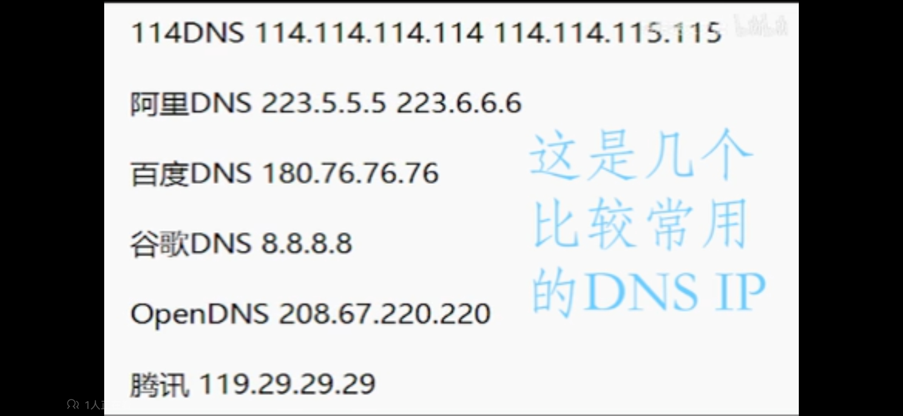

[TOC]


# Connect to DNS


**DNS**

- Domain Name System =  黄页 

- DNS Server-> give nickname -> return  ip address your looking at

- Endpoint always doing that 


**nslookup** (tool)

- windows command line, do:

  - `nslookup`

  - ```
    C:\Users\Lenovo>nslookup
    默认服务器:  public-dns-a.baidu.com
    Address:  180.76.76.76
    ```

  - 默认服务器: DNS Server Name

  - IP地址: 180.76.76.76

- Then type nickname, e.g. youtube.com

  - type: youtube.com 

  - return: 

    - ```
      非权威应答:
      名称:    youtube.com
      Addresses:  2001::c73b:95d2
                108.160.169.185
      ```

    - 108.160.169.185 this is the address 


**ISP**

- Internet Service Provider 


Open DNS

- `opendns.com`

- -> consumer (learn mroe) -> Home OpenDHS Home (Sign UP)

- name server ip:
  - 208.67.222.222
  - 208.67.220.220
  - 最短 = 53ms，最长 = 79ms，平均 = 62ms


**Home Router** 

- Change the DNS on it 
- go to `tplogin.cn`, login, 路由设置,DHCP服务器,Change:首选DNS备用DNS -> save


**Win 11**

网络和internet设置-> 高级网络设置 ->更多网络适配器选项 -> WLAN(wifi) / 以太网(有线) ->属性 ->IPv4 ->使用下面的DNS服务器地址 ->首选/备用DNS

- 


Windows Command line:

- `ipconfig` –> check current 
- `ipconfig /release` -> 
- `ipconfig /renew` ->


Check we are using OpenDNS

- when sure， next step


# Config Open NDS

- 登录
- Add a network
  - this will detect your ip address and show it 
  - Many sure it won’t change 
    - (f using VPN this will change every time you refresh the page 

- Give it a name and set the configuration
- Click on your network to config


## 1. Web Content Filtering

Filtering level

- Moderate is ok
- this change takes 3 mins to propagate/exist 


Block/Never Block specific Website

- Manage individual domains
- Always block/never block
  - e.g. netflix.com, hulu.com


## 2. Security

Customize Protection 

- Suspicious Response 
  - Block internal IP address (PLZ always tick this )


## 3. Customization 

The page you wanna show when you are being caught


## 4. Stats and Logs

Enable stats and logs 

- less security 
- over time get cool graphs in stats 