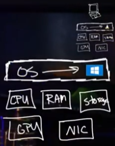
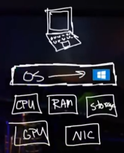
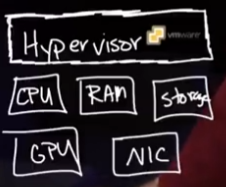
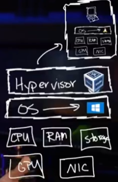
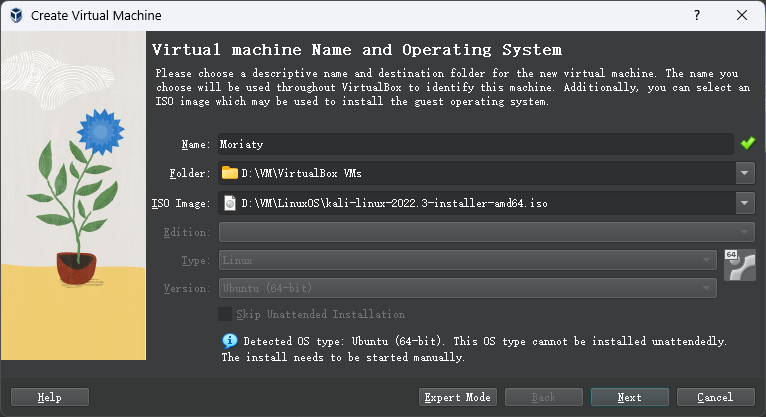
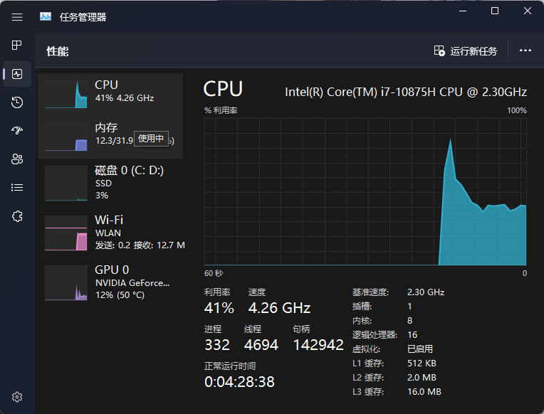
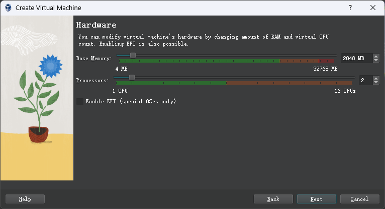
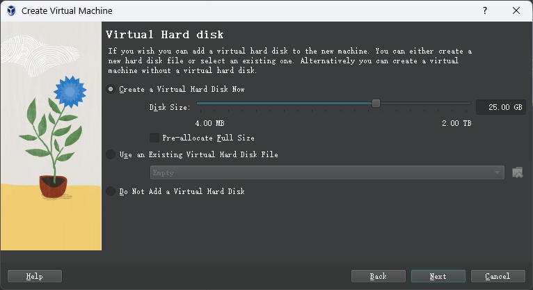
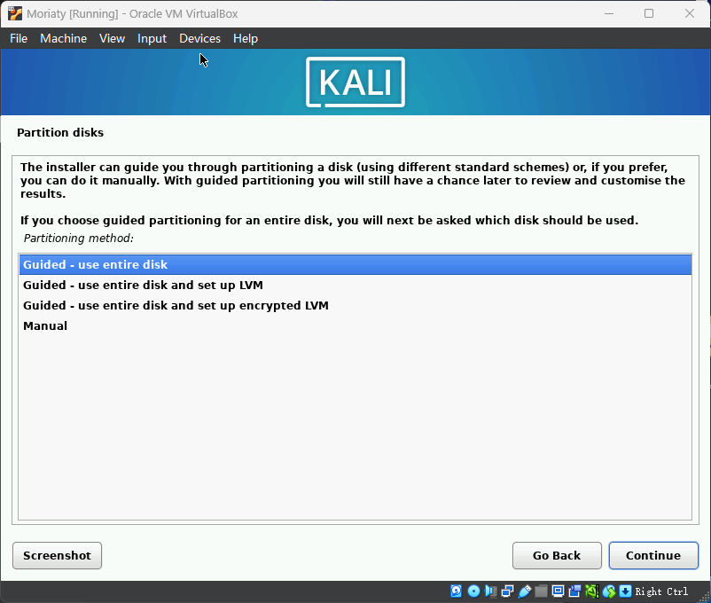
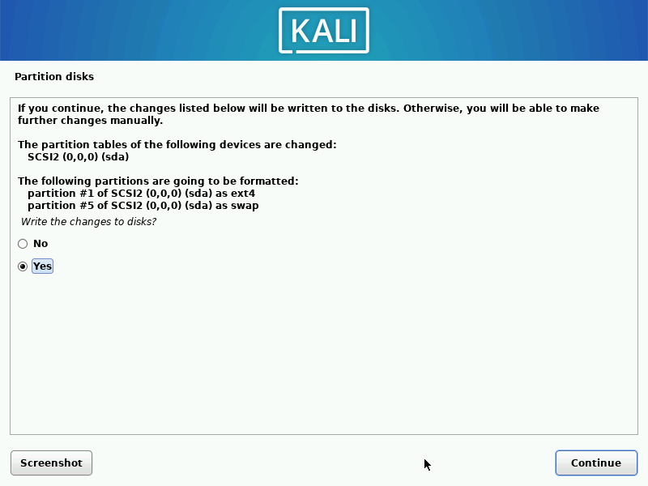

{:toc}

# Lesson 1

## What is a **Virtual Machine**?

- a Computer in an computer  
- See: 

**Computer** normally is 

- physically is (resource)

  - RAM

  - Storage

  - CPU

  - GPU
  - NIC

- with an OS work on top 
  - e.g. Windows, Mac X, Linux

- See: 

**Hypervisor** 

- to give/manage physical resource to the virtual machine 

- **Type 1 Hypervisor**:
  - Supervisor works directly on physical resource 
  - e.g. **VMware ESXi**
  - See: 

- **Type 2 Hypervisor**
  - An **application**, work on the **Host OS**, create VM who use **Guest OS**
  - Hypervisor must **ask the Host OS**: Host allow resources to Guest
  - e.g. **Virtual box** (free)
  - See: 

In real word:

- Using type 1 Hypervisor 
- Installed on big servers:
  - Dell server / 戴尔
  - Hp server / 惠普
  - …

**Why we need a VM**

1. Learn Hacking. We should use VM to do Hacking. It is **Secure** 
   - this machine is **isolated**!
   - When you hacking, you probably gonna connect to a network that other people may exist. AND! That is a RISK that yourself might be hacked by others 
2. Learn to use an different OS
3. Break things as you like

## VM Setup

### Pre

**Pre-request:**

- At least 2 CPU
- At least 4GB RAM

If computer want to install a **64 bit OS** version:

- need to change BIOS to enable hardware virtualization support for your CPU
- Windows更新 > 高级选项 > 恢复 > 高级启动 > 重启后 选择疑难解答 > UEFI 固件设置 > 重启 > Bios
- Bios > Setup > Advanced > CPU Configuration > Intel (VMX) Virtualization Technology / AMD V > Enable > Save and Exit

### Download and Install

Download the OS 的 **.iso file**

- **Kali Linux** download: http://bit.ly/39HEE4q
- **Ubuntu** download: http://bit.ly/39DKTpQ
- Windows：
  - Win11：https://www.microsoft.com/software-download/windows11
  - Win10：https://www.microsoft.com/software-download/windows10

- **macOS**: ventura 13.0.1
  - [Download macOS Ventura ISO for Virtualbox and VMWare - TechRechard](https://techrechard.com/download-macos-ventura-iso-for-virtualbox-and-vmware/)
    - just follow this guide 
  - [Apple Releases macOS Ventura 13.0.1 [Download\] - iClarified](https://www.iclarified.com/88032/apple-releases-macos-ventura-1301-download)

What is **ISO**

- also called **digital images** or **disc images**

- is An **optical disc disk image** such as a CD, DVD, or Blu-ray Disc. 
  - **The International Organization for Standardization** (ISO) maintains the ISO standard
  - They are sometimes written on a CD or DVD as an alternative to creating a physical copy of the original media

- they can be read on any platform with an appropriate software player installed

Download **the hypervisor** 

1. Download Virtual Box: http://bit.ly/368FS7Z
2. Install it and do not change anything 
3. Download Virtual Box Extension Pack: https://bit.ly/3svvPmV

4. Install the Extension

### Create VM

**Start** the very first VM !!!

1. Click ‘NEW’
2. 

2. Decide the memory and cpu for the VM:
   - have a look at the task manager, see normally how much you use:
     - 
     - in this case:
       - memory: 13g/32g, but leave at least 18 g for our host 
       - CPU: 8/16, at least 10 for our host
   - 

3. Create virtual hard drive:
   - 

4. Check the Summery, and create!

Info when creating:

- **Virtual Hard Disk type**:
  - VDI (VirtualBox Disk Image) — defualt 
  - VHD (Virtual Hard Disk)
  - VMDK (Virtual Machine Disk)

- Storage on physical hard disk 
  - **Dynamically allocated** — defualt
    - little slower but only use the physical hard disk place as it fill up
  - Fixed size 
    - a bit quicker, but occumpy the whole place, say 10 GB, on the physical hard disk

**Start the machine** and complete all the requirement 

1. click the VM instance
2. click Start ->
3. This is Right, sounds wrong but Yes 

4. YES and YES (defualt is no, so change it )

**Operation Notice** 

- to get outof the VM, Click **the Right Control** 

### Right Click the Instance 

\

When the **VM is on**

**Pause**

- Stop 
- freeze the machine, like pase a game
- use less physical computer resource 

**Result**

- Forcefully!! 
- like unplug in then plug in 
- data not saved will be all lost 

**Close**

- **Save the state** ( extremely usefull )
  - you can save the state, close the Virtual Box, and go to sleep, 
  - tomorrow, select the instance, click on start, then continue your work!

- ACPI Shutdown 
  - a normal shutdown

When the **VM is powered off**

**Clone** - a bit heavy

- defualt + full-clone = make a copy of the VM! **a back up**!
- so you can continue to BREAK things, then come back with a working machine!

Click the tocalled 3 tool bars 

-> **Snapshots** - much lighter! 

-> take a snapshot 

-> save and name it 

- Key: 
  - snapshot is taken when VM is running 
  - snapshot is open when VM is powered off! 
    - left click the snapshot and **Restore..**!

### Setting of VM

1. click the VM instance 
2. click Settings

**System** 

- Processor
  - adjust number of CPU gives 

**General** 

- Advanced (Convenience with the cost of security)
  - Shared Clipboard 
  - Drag and Drop

**Network**

- Adapter

  - attached to **NAT** (High security)
    - means not on my home network 
    - if you scan my notwork, you will not see this virtual machine 
    - if you scan my virtual machine, you will not discover my home network 

  - attached to **Bridged Adapter** (Low security)
    - means it is on my home network

**Shared Folders**

- You can share a folder between Guest and Host, with cost of security

