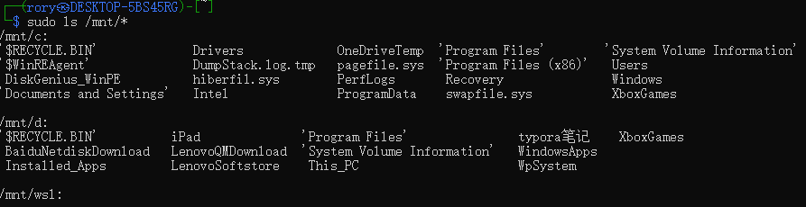
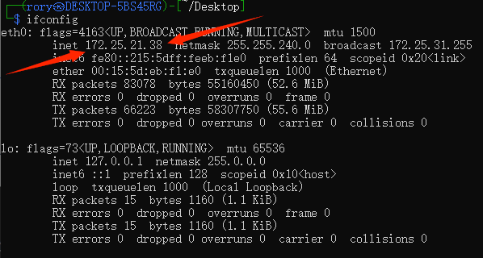
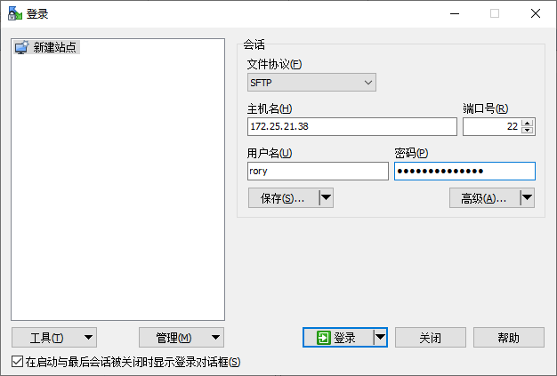
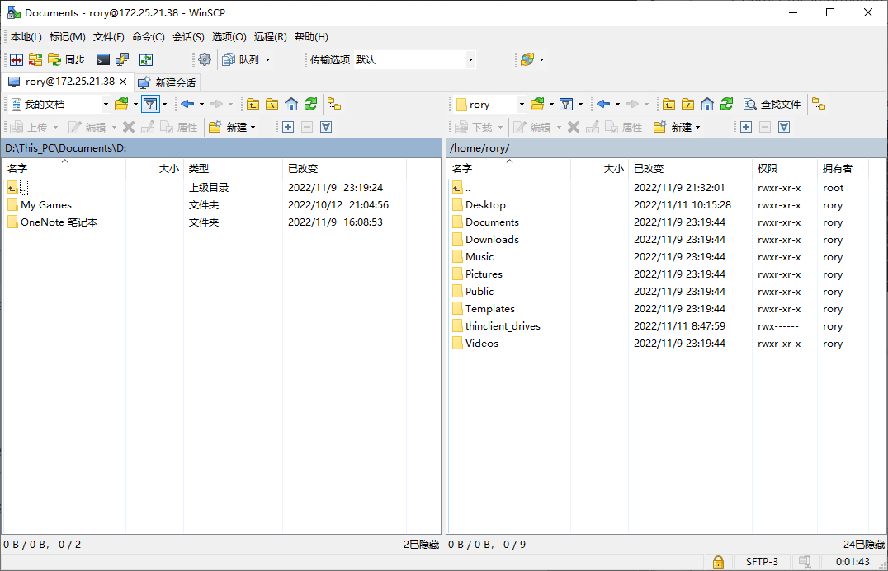

[TOC]

# Copy files 


## 原理


WSL1:

- By default, Windows Subsystem for Linux automatically mounts the C$ drive on the Windows 10 host system


WSL2:

- you **can’t** see the mounted file system
- bacause it is abstracted by way of the transparent **Hyper-V** utility VM that is used to house the WSL instance


## Using /mnt


-> you can enumerate the files and folders on the Windows 10 host



just copy!

```
Formate:
cp [from][to]

Example:
# file to current position 
cp /mnt/c/TransToLinux/academy-regular.ovpn .
```


## Using ssh 

1. uninstall the buildin tool: `openssh-server`
   - by `sudo apt remove openssh-server`
2. Then reinstall it:
   - by `sudo apt install openssh-server`
3. Edit the **sshd_config** file to allow password authentication:
   - do `sudo nano /etc/ssh/sshd_config`
   - remove the # before `PasswordAuthentication yes` and `PermitRootLogin yes`
4. Restart the ssh service 
   - `sudo service ssh restart`
   - 
5. Gather the information to connect
   - Find the IP address for your WSL installation
   - `sudo apt install net-tools` ( if not already downloaded )
   - `ifconfig` get the ip address 
     - 

6. Connect using WinSCP

   - 

   - 


# Very slow network speed


## Soln 1

On Windows

1. run Powershell as Administrator
2. run ` Set-NetAdapterLso -Name "vEthernet (WSL)" -IPv4Enabled $False -IPv6Enabled $False`


## Soln 2

On linux 

- Follow this *https://www.youtube.com/watch?v=MZUlr1TIp6Q*

